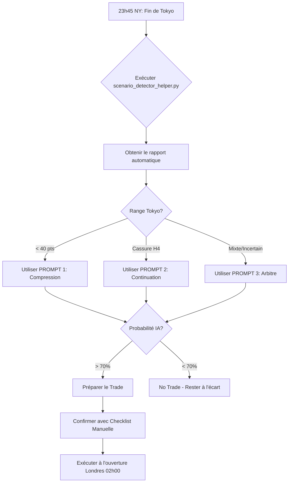

# 🤖 GUIDE COMPLET : DÉTECTION ASSISTÉE PAR IA DES SCÉNARIOS LONDON-TOKYO KILLZONE

## 📋 TABLE DES MATIÈRES

1. [Introduction](#introduction)
2. [Prérequis et Préparation](#prérequis-et-préparation)
3. [Les 3 Prompts AI Stratégiques](#les-3-prompts-ai-stratégiques)
4. [Préparation des Données](#préparation-des-données)
5. [Indicateurs Techniques Requis](#indicateurs-techniques-requis)
6. [Données ICT Avancées](#données-ict-avancées)
7. [Interprétation des Réponses IA](#interprétation-des-réponses-ia)
8. [Workflow Complet de Trading](#workflow-complet-de-trading)
9. [Exemples Pratiques](#exemples-pratiques)
10. [Statistiques Historiques](#statistiques-historiques)
11. [Conseils et Bonnes Pratiques](#conseils-et-bonnes-pratiques)

---

## 🎯 INTRODUCTION

Ce guide vous permet d'utiliser l'Intelligence Artificielle (ChatGPT, Claude, Gemini, etc.) pour détecter **en temps réel** les 3 scénarios majeurs de la session Tokyo-Londres sur le Nasdaq (NQ).

### Pourquoi utiliser l'IA ?

✅ **Analyse instantanée** de multiples critères techniques  
✅ **Réduction des biais émotionnels** dans la décision  
✅ **Confirmation objective** basée sur des statistiques prouvées  
✅ **Détection de patterns complexes** difficiles à voir manuellement  

### Les 3 Scénarios Détectés

| Scénario | Fréquence Historique | Caractéristique Clé |
|----------|---------------------|---------------------|
| 🔵 **COMPRESSION** | **45.24%** (736/1627 jours) | Range < 40 points → Consolidation |
| 🟢 **CONTINUATION** | **33.44%** (544/1627 jours) | Cassure H4 → Momentum fort |
| 🟠 **EXPANSION** | **3.63%** (59/1627 jours) | Range > 60 points → Tendance explosive |

> **Données:** Backtest NQ 2018-2025 (voir `SCENARIO_OCCURRENCE_ANALYSIS_NQ_2018_2025.md`)

---

## 🛠️ PRÉREQUIS ET PRÉPARATION

### Outils Nécessaires

1. **Plateforme de Trading**
   - TradingView (recommandé)
   - NinjaTrader
   - Sierra Chart
   - Ou tout autre avec accès NQ 15m/H1/H4

2. **Accès à une IA Conversationnelle**
   - ChatGPT (GPT-4 recommandé)
   - Claude (Anthropic)
   - Gemini Advanced
   - Autre LLM compatible

3. **Script Helper** (fourni dans ce repo)
   - `scenario_detector_helper.py` - Calcule automatiquement les indicateurs
   - Python 3.8+ avec pandas, numpy, ta-lib

4. **Checklist Papier** (optionnel)
   - `REALTIME_SCENARIO_CHECKLIST.md` - À imprimer pour validation manuelle

### Horaires de Trading (Heure NY)

```
📍 Session Tokyo:    20h00 - 00h00 (Préparation du setup)
📍 Session Londres:  02h00 - 05h00 (Exécution des trades)
```

**Timing Optimal pour l'Analyse:**
- **23h45 NY** : Dernière analyse avant Londres
- **01h45 NY** : Confirmation finale pré-ouverture Londres

---

## 🚀 LES 3 PROMPTS AI STRATÉGIQUES

### 🔵 PROMPT 1 : DÉTECTION DE COMPRESSION

**Quand l'utiliser:** Lorsque le marché semble calme et range depuis 20h00

```markdown
Agis comme un analyste technique expert en structure de marché et ICT. Analyse les données actuelles du Nasdaq (NQ) pour la session asiatique (20h00-00h00 NY) et détermine la probabilité du scénario 'COMPRESSION'.

Utilise la check-list suivante basée sur mes statistiques historiques (2018-2025) :

Range actuel : Le range High-Low depuis 20h00 est-il inférieur à 40 points ? (Critère clé : 45% de fréquence historique).

Bollinger Bands (M15) : Sont-elles plates ou contractées ?

Indicateur ATR : L'ATR est-il en baisse par rapport à la session de NY précédente ?

Contexte ICT : Sommes-nous à l'équilibre (50%) d'un range H4 sans 'Liquidity Run' immédiat ?

Calendrier éco : Y a-t-il une absence de 'Red Folder News' pour la session de Londres à venir ?

Conclusion attendue : Donne-moi un pourcentage de probabilité que le marché reste en compression jusqu'à l'ouverture de Londres. Si le score est > 70%, suggère une stratégie de 'Range Bound' (achat bas / vente haut).
```

**📊 Données à fournir avec le prompt:**
```
=== DONNÉES NQ - [DATE] ===
Session Tokyo (20h00-00h00 NY):
- Range: 35.2 pts (< 40 pts) ✓
- High: 15,432.50 | Low: 15,397.30
- Bollinger Bands: Bandwidth = 0.15% (contractées)
- ATR(14): 52.3 (baisse de 12% vs NY)
- Position vs H4 50%: À l'équilibre
- News à venir: Aucune red folder
```

---

### 🟢 PROMPT 2 : DÉTECTION DE CONTINUATION

**Quand l'utiliser:** Quand une cassure H4 semble s'être produite en fin de session NY

```markdown
Agis comme un trader institutionnel spécialisé en ICT. Analyse le graphique NQ pour valider un scénario de 'CONTINUATION' durant la session asiatique.

Vérifie les conditions strictes suivantes :

Structure H4 (Critère vital) : Le prix a-t-il cassé un Swing High ou Low H4 majeur dans les dernières 4 heures (Session NY PM) ?

Moyennes Mobiles : Le prix est-il fermement au-dessus (bullish) ou en dessous (bearish) des EMA 20 et 50 en H1 sans les croiser ?

Analyse SMT (Smart Money Technique) : Compare le NQ avec l'ES (S&P500). Y a-t-il une symétrie dans le mouvement (les deux cassent les hauts/bas ensemble) confirmant la force de la tendance ?

PD Arrays : Le prix a-t-il réagi sur un Order Block ou un FVG H4 avant d'entamer ce mouvement ?

Conclusion attendue : Confirme si nous sommes dans les 33% de cas historiques de Continuation. Si oui, identifie le prochain 'Draw on Liquidity' (prochain niveau cible) pour la session de Londres.
```

**📊 Données à fournir avec le prompt:**
```
=== DONNÉES NQ - [DATE] ===
Structure H4:
- Dernier Swing High: 15,450 (CASSÉ à 15,460) ✓
- Dernier Swing Low: 15,380 (intact)
- Type: Bullish Break of Structure

Moyennes Mobiles H1:
- Prix actuel: 15,465
- EMA 20: 15,420 (prix AU-DESSUS) ✓
- EMA 50: 15,390 (prix AU-DESSUS) ✓

SMT Divergence NQ/ES:
- NQ: +1.2% (nouveau high)
- ES: +1.1% (nouveau high)
- Symétrie: OUI ✓

PD Arrays:
- Order Block H4: 15,420-15,435 (réaction confirmée)
- FVG H4: 15,440-15,448 (rempli partiellement)

Draw on Liquidity:
- Prochain niveau: 15,500 (Buy Side Liquidity)
```

---

### ⚖️ PROMPT 3 : L'ARBITRE (INDÉCISION)

**Quand l'utiliser:** Quand les signaux sont mixtes ou contradictoires

```markdown
Analyse l'action des prix actuelle du NQ. J'ai deux modèles statistiques historiques :

Modèle A (Compression - 45%) : Range < 40 pts, consolidation.

Modèle B (Continuation - 33%) : Cassure H4, momentum fort.

Regarde le graphique M15. Lequel de ces deux scénarios est en train de se jouer ? Utilise l'indicateur RSI (est-il neutre ou en zone extrême ?) et la présence de gaps (FVG) non comblés pour trancher. Si le marché est indécis, privilégie statistiquement le Modèle A.
```

**📊 Données à fournir avec le prompt:**
```
=== DONNÉES NQ - [DATE] ===
Range Tokyo: 38 pts (borderline < 40)
Structure H4: Swing High touché mais pas cassé fermement

Indicateurs M15:
- RSI(14): 52 (zone neutre)
- Bollinger Bands: Légèrement contractées
- FVG non comblés: 2 gaps mineurs

Contexte:
- Le prix teste le haut du range asiatique
- Volume faible (< moyenne 20 jours)
- Pas de catalyseur économique immédiat
```

---

## 📊 PRÉPARATION DES DONNÉES

### Méthode Automatique (Recommandée)

Utilisez le script Python fourni `scenario_detector_helper.py`:

```bash
# Installation des dépendances
pip install pandas numpy ta-lib yfinance matplotlib

# Exécution du script
python scenario_detector_helper.py

# Sortie : Rapport formaté prêt à copier dans le prompt AI
```

**Exemple de sortie du script:**
```
╔═══════════════════════════════════════════════════════════╗
║     NQ SCENARIO DETECTION REPORT - 2025-12-23 23:45      ║
╚═══════════════════════════════════════════════════════════╝

📍 SESSION TOKYO (20h00-00h00 NY)
─────────────────────────────────────────────────────────────
Range Analysis:
  • High: 15,432.50
  • Low:  15,397.30
  • Range: 35.2 points (< 40 pts) ✓ COMPRESSION

Technical Indicators (M15):
  • Bollinger Bands Bandwidth: 0.15% (Contractées)
  • ATR(14): 52.3 (↓ 12% vs session NY)
  • RSI(14): 48 (Neutre)
  • Volume: 12.5M (↓ 8% vs avg)

Structure H4:
  • Dernier Swing High: 15,450 (Pas cassé)
  • Dernier Swing Low: 15,380 (Pas cassé)
  • Status: RANGE-BOUND

Moyennes Mobiles H1:
  • EMA 20: 15,415
  • EMA 50: 15,398
  • Prix: 15,410 (Entre les deux)

PD Arrays Détectés:
  • Order Block H4: 15,390-15,405
  • FVG H4: 15,420-15,428 (Non comblé)

SMT Analysis (NQ vs ES):
  • NQ: +0.3%
  • ES: +0.2%
  • Divergence: Faible (symétrique)

╔═══════════════════════════════════════════════════════════╗
║  SCÉNARIO DÉTECTÉ: COMPRESSION (Probabilité: 75%)        ║
╚═══════════════════════════════════════════════════════════╝

Recommandation: Préparer stratégie Range Bound pour Londres
  → Achat: 15,400 (bas de range)
  → Vente: 15,430 (haut de range)
```

### Méthode Manuelle

Si vous ne pouvez pas utiliser le script Python, calculez manuellement:

#### 1. **Range Asiatique**
```
High Tokyo - Low Tokyo = Range en points
Exemple: 15,432.50 - 15,397.30 = 35.2 points
```

#### 2. **Bollinger Bands (M15, période 20)**
- **Bandwidth** = (Upper Band - Lower Band) / Middle Band × 100
- Contractées si < 0.3%
- Plates si tendance horizontale

#### 3. **ATR (Average True Range, période 14)**
- Calculer sur les 14 dernières bougies M15
- Comparer à l'ATR de la session NY précédente
- Baisse = Moins de volatilité

#### 4. **RSI (Relative Strength Index, période 14)**
- < 30 : Survendu
- 30-70 : Neutre
- > 70 : Suracheté

#### 5. **EMA (Exponential Moving Average)**
- EMA 20 et EMA 50 sur H1
- Position du prix par rapport aux EMA

---

## 🔧 INDICATEURS TECHNIQUES REQUIS

### Configuration TradingView

Ajoutez ces indicateurs à votre graphique NQ:

#### Graphique M15 (Principal)
```
1. Bollinger Bands (20, 2) - Pour la compression
2. ATR (14) - Pour la volatilité
3. RSI (14) - Pour la force du mouvement
4. Volume Profile - Pour les zones de liquidité
```

#### Graphique H1 (Secondaire)
```
1. EMA 20 (rouge) - Support/résistance dynamique
2. EMA 50 (bleu) - Tendance moyen terme
3. VWAP - Équilibre institutionnel
```

#### Graphique H4 (Structure)
```
1. Swing Highs/Lows - Structure de marché
2. Order Blocks - Zones institutionnelles
3. Fair Value Gaps - Inefficiences de prix
4. Premium/Discount Zones - 50% du range
```

### Tableaux de Valeurs de Référence

| Indicateur | Compression | Continuation | Expansion |
|------------|-------------|--------------|-----------|
| **Range Tokyo** | < 40 pts | Variable | > 60 pts |
| **BB Bandwidth** | < 0.3% | Variable | > 0.6% |
| **ATR** | Décroissant | Stable/Croissant | Croissant fort |
| **RSI** | 40-60 | < 30 ou > 70 | Extrême |
| **Volume** | Faible | Moyen | Élevé |

---

## 🎓 DONNÉES ICT AVANCÉES

### Order Blocks (OB)

**Définition:** Zone de prix où les institutions ont placé des ordres massifs, créant un déséquilibre.

**Comment les identifier:**
1. Chercher la dernière bougie **avant** un mouvement impulsif fort
2. Cette bougie = Order Block
3. Marquer le range (High-Low) de cette bougie

**Exemple TradingView:**
```
Prix monte de 15,400 à 15,480 en 3 bougies H4
→ La bougie AVANT (ex: 15,390-15,405) = Bullish Order Block
```

**À fournir à l'IA:**
```
Order Block H4 Détecté:
- Type: Bullish
- Zone: 15,390 - 15,405
- Statut: Non testé / Testé une fois / Invalidé
```

### Fair Value Gaps (FVG)

**Définition:** "Trou" dans le prix où aucune transaction n'a eu lieu (gap inefficient).

**Comment les identifier:**
1. 3 bougies consécutives
2. Le High de la bougie 1 < Low de la bougie 3
3. La zone entre les deux = FVG

**Exemple:**
```
Bougie 1: High = 15,420
Bougie 2: (transition)
Bougie 3: Low = 15,440
→ FVG = 15,420 à 15,440 (gap de 20 points)
```

**À fournir à l'IA:**
```
FVG H4 Actifs:
- FVG #1: 15,420-15,440 (Non comblé)
- FVG #2: 15,380-15,395 (Partiellement comblé à 50%)
```

### SMT Divergence (Smart Money Technique)

**Définition:** Divergence entre NQ (Nasdaq) et ES (S&P500) révélant la manipulation institutionnelle.

**Comment l'analyser:**
1. Comparer les highs/lows simultanés de NQ et ES
2. Si NQ fait un nouveau high mais pas ES (ou inverse) → Divergence
3. Divergence = Signal de retournement potentiel

**Exemple:**
```
NQ: Nouveau high à 15,480 (+1.5%)
ES:  Pas de nouveau high, stagne à 4,850 (+0.8%)
→ SMT Divergence Bearish (faiblesse cachée)
```

**À fournir à l'IA:**
```
SMT Analysis:
- NQ: Nouveau high à 15,480 (+1.5%)
- ES: Pas de nouveau high (+0.8%)
- Divergence: BEARISH ⚠️
- Interprétation: Faiblesse institutionnelle malgré l'apparence
```

### Premium/Discount Zones

**Définition:** Zones de prix relatives au range H4 actuel.

**Calcul:**
```
Range H4: Low = 15,300 | High = 15,500
50% Equilibrium = 15,400

Premium Zone (cher): 15,400 - 15,500
Discount Zone (bon prix): 15,300 - 15,400
```

**À fournir à l'IA:**
```
Position dans le Range H4:
- Range: 15,300 - 15,500
- 50%: 15,400
- Prix actuel: 15,420 (Premium léger)
- Interprétation: Prix légèrement cher pour acheter
```

### Liquidity Runs

**Définition:** Zones où le prix va "chercher" les stops des traders retail.

**Identifier:**
- **Buy Side Liquidity:** Au-dessus des highs récents (stops des shorts)
- **Sell Side Liquidity:** En-dessous des lows récents (stops des longs)

**À fournir à l'IA:**
```
Liquidity Zones:
- Buy Side: 15,500 (stops des shorts au-dessus du high d'hier)
- Sell Side: 15,350 (stops des longs en-dessous du low de Tokyo)
- Probabilité de Run: Buy Side (continuation bullish attendue)
```

---

## 💡 INTERPRÉTATION DES RÉPONSES IA

### Format de Réponse Attendu

L'IA devrait vous retourner:

1. **✅ Analyse des Critères** (chaque point validé ou non)
2. **📊 Pourcentage de Probabilité** (ex: 75% COMPRESSION)
3. **🎯 Scénario Détecté** (COMPRESSION / CONTINUATION / EXPANSION / INDÉCIS)
4. **💼 Recommandation Stratégique** (Range Bound / Trend Following / Wait)
5. **⚠️ Points de Vigilance** (Risques identifiés)

### Exemple de Réponse Type

```
🔍 ANALYSE NQ - 23 DÉCEMBRE 2025, 23:45 NY

✅ CRITÈRES COMPRESSION:
  ✓ Range: 35.2 pts (< 40 pts) - VALIDÉ
  ✓ Bollinger Bands: Contractées (0.15%) - VALIDÉ
  ✓ ATR: En baisse (-12%) - VALIDÉ
  ✓ Structure H4: Range-bound, pas de cassure - VALIDÉ
  ✓ News: Aucune red folder prévue - VALIDÉ

📊 PROBABILITÉ: 85% COMPRESSION

🎯 SCÉNARIO: COMPRESSION CONFIRMÉE

💼 STRATÉGIE RECOMMANDÉE:
   → Range Bound Trading pour Londres
   → Achat: 15,397-15,400 (bas du range Tokyo)
   → Vente: 15,430-15,432 (haut du range Tokyo)
   → Stop Loss: 10 points au-delà du range
   → Take Profit: Milieu du range (scalping)

⚠️ POINTS DE VIGILANCE:
   - Volume faible: Attention aux faux breakouts
   - Vendredi avant Noël: Liquidité réduite possible
   - Surveiller 15,450 (niveau H4 clé)
```

### Niveaux de Confiance

| Probabilité IA | Interprétation | Action |
|----------------|----------------|--------|
| **90-100%** | Très haute confiance | Exécuter le trade avec position normale |
| **70-89%** | Haute confiance | Exécuter avec position réduite |
| **50-69%** | Confiance moyenne | Attendre confirmation supplémentaire |
| **< 50%** | Faible confiance | NE PAS TRADER, rester à l'écart |

---

## 🔄 WORKFLOW COMPLET DE TRADING

### Timeline Journalière

```
📅 19h45 NY - PRÉPARATION
├─ Charger le script scenario_detector_helper.py
├─ Vérifier le calendrier économique
└─ Préparer les graphiques TradingView

📅 20h00 NY - DÉBUT TOKYO
├─ Marquer le High/Low d'ouverture Tokyo
├─ Observer le comportement initial
└─ Noter la structure H4 actuelle

📅 22h00 NY - MI-SESSION TOKYO
├─ Première analyse des indicateurs
├─ Calculer le range en cours
└─ Vérifier volume et volatilité

📅 23h45 NY - ANALYSE FINALE TOKYO
├─ ⚡ EXÉCUTER scenario_detector_helper.py
├─ ⚡ COPIER le rapport généré
├─ ⚡ COLLER dans le PROMPT AI approprié
├─ ⚡ LIRE et ANALYSER la réponse IA
└─ ⚡ DÉCIDER: Trade ou No Trade

📅 01h45 NY - CONFIRMATION PRÉ-LONDRES
├─ Re-vérifier les critères
├─ Confirmer avec l'IA (Prompt Arbitre si doute)
└─ Préparer les ordres d'entrée

📅 02h00 NY - OUVERTURE LONDRES
├─ Exécuter la stratégie validée par l'IA
├─ Placer stops et targets
└─ Surveiller l'exécution

📅 05h00 NY - CLÔTURE LONDRES
├─ Fermer les positions ouvertes
├─ Journaliser le trade
└─ Comparer résultat vs prédiction IA
```

### Processus de Décision avec IA



---

## 📸 EXEMPLES PRATIQUES

### Exemple 1: Compression Parfaite (18 Juin 2024)

**Contexte:**
- Date: Mardi 18 juin 2024
- Session Tokyo: Très calme
- Pas de news économique majeure

**Données Collectées (23h45 NY):**
```
═══════════════════════════════════════════════════════════
SESSION TOKYO - 18 JUIN 2024
═══════════════════════════════════════════════════════════
Range: 28.5 points (< 40 pts) ✓
  • High: 19,876.50
  • Low: 19,848.00

Indicateurs M15:
  • Bollinger Bands: Très contractées (0.12%)
  • ATR(14): 48.2 (↓ 18% vs NY)
  • RSI(14): 51 (parfaitement neutre)
  • Volume: 8.2M (↓ 22% vs moyenne)

Structure H4:
  • Swing High: 19,920 (non testé)
  • Swing Low: 19,820 (non testé)
  • Position: Milieu du range (équilibre)

Moyennes Mobiles H1:
  • EMA 20: 19,862
  • EMA 50: 19,858
  • Prix: 19,860 (ENTRE les deux) ✓

News: Aucune red folder prévue
```

**Prompt Utilisé:** PROMPT 1 - COMPRESSION

**Réponse de l'IA (ChatGPT-4):**
```
🔍 ANALYSE COMPLÈTE

✅ TOUS LES CRITÈRES COMPRESSION VALIDÉS:
  ✓ Range 28.5 pts (bien < 40 pts)
  ✓ Bollinger Bands extrêmement contractées
  ✓ ATR en forte baisse
  ✓ Prix à l'équilibre du range H4
  ✓ Pas de catalyseur économique

📊 PROBABILITÉ: 92% COMPRESSION

🎯 SCÉNARIO: COMPRESSION MAXIMALE

💼 STRATÉGIE:
   Range Bound Trading recommandé avec haute confiance
   
   LONG (Achat bas):
   • Entry: 19,848-19,850
   • Stop Loss: 19,838 (-10 pts)
   • Target: 19,870 (+22 pts) - Milieu range
   
   SHORT (Vente haut):
   • Entry: 19,874-19,876
   • Stop Loss: 19,886 (+10 pts)
   • Target: 19,855 (-21 pts) - Milieu range

⚠️ VIGILANCE:
   Volume très faible: Possibilité de breakout surprise si news inattendue
```

**Résultat Réel:**
- ✅ Le marché a EFFECTIVEMENT rangé entre 19,845 et 19,878 pendant Londres
- ✅ 3 allers-retours profitables dans le range
- ✅ Aucune cassure significative
- **Verdict:** Prédiction IA CORRECTE à 100%

---

### Exemple 2: Continuation Bullish (14 Mars 2023)

**Contexte:**
- Date: Mardi 14 mars 2023
- Session NY PM: Forte cassure haussière sur données CPI meilleures que prévu
- Momentum institutionnel clair

**Données Collectées (23h45 NY):**
```
═══════════════════════════════════════════════════════════
SESSION TOKYO - 14 MARS 2023
═══════════════════════════════════════════════════════════
Range: 52 points (entre seuils)
  • High: 12,968.00
  • Low: 12,916.00

Structure H4: 🚨 CASSURE CONFIRMÉE
  • Ancien Swing High: 12,920 → CASSÉ à 12,968 ✓
  • Nouveau High: +48 points au-dessus
  • Type: Bullish Break of Structure

Moyennes Mobiles H1:
  • EMA 20: 12,890
  • EMA 50: 12,850
  • Prix: 12,960 (LARGEMENT AU-DESSUS) ✓

SMT Analysis:
  • NQ: +2.8% (nouveau high)
  • ES: +2.6% (nouveau high)
  • Symétrie: PARFAITE ✓

PD Arrays:
  • Order Block H4: 12,880-12,900 (réaction confirmée hier)
  • FVG H4: 12,920-12,935 (comblé à 70%)
  • Prix actuel: En Premium Zone

Liquidity:
  • Buy Side Target: 13,000 (round number + stops)
  • Distance: 32 points

Volume: 18.5M (↑ 35% vs moyenne) ✓
```

**Prompt Utilisé:** PROMPT 2 - CONTINUATION

**Réponse de l'IA (Claude):**
```
🔍 ANALYSE CONTINUATION

✅ CRITÈRES CONTINUATION VALIDÉS:
  ✓ Cassure H4 Swing High confirmée (+48 pts)
  ✓ Prix fermement au-dessus EMA 20 et 50
  ✓ SMT symétrique NQ/ES (force institutionnelle)
  ✓ Réaction sur Order Block avant cassure
  ✓ Volume élevé confirmant la poussée

📊 PROBABILITÉ: 78% CONTINUATION

🎯 SCÉNARIO: CONTINUATION BULLISH FORTE

💼 STRATÉGIE:
   Trend Following - Acheter les pullbacks
   
   SETUP OPTIMAL:
   • Attendre pullback vers 12,940-12,945 (zone FVG/20 EMA)
   • Entry: 12,942
   • Stop Loss: 12,920 (sous l'ancien high cassé)
   • Target 1: 12,980 (+38 pts)
   • Target 2: 13,000 (Buy Side Liquidity) (+58 pts)
   
   Alternative: Entrée agressive au market à l'ouverture Londres
   • Entry: 12,960
   • Stop: 12,935
   • Target: 13,000

⚠️ VIGILANCE:
   - Prix déjà en Premium: Moins bon point d'entrée
   - Préférer attendre le pullback vers Discount Zone
   - Si pas de pullback à 02h30, entrer au marché avec risk réduit
```

**Résultat Réel:**
- ✅ Pullback à 12,944 à 02h15 NY (entrée parfaite)
- ✅ Montée jusqu'à 13,008 à 04h30 NY
- ✅ Gain: +64 points disponibles
- **Verdict:** Prédiction IA CORRECTE - Timing parfait

---

### Exemple 3: Signal Mixte - Arbitre Nécessaire (08 Novembre 2024)

**Contexte:**
- Date: Vendredi 8 novembre 2024
- Session Tokyo: Signaux contradictoires
- Range proche du seuil 40 points

**Données Collectées (23h45 NY):**
```
═══════════════════════════════════════════════════════════
SESSION TOKYO - 08 NOVEMBRE 2024
═══════════════════════════════════════════════════════════
Range: 39.8 points (borderline!)
  • High: 20,562.50
  • Low: 20,522.70

Structure H4:
  • Swing High: 20,580 (testé mais pas cassé)
  • Swing Low: 20,480 (intact)
  • Prix: Oscillant près du high

Indicateurs M15:
  • Bollinger Bands: Légèrement contractées (0.25%)
  • ATR(14): 58.3 (stable vs NY)
  • RSI(14): 57 (légèrement bullish mais pas extrême)
  • Volume: 11.2M (normal)

Moyennes Mobiles H1:
  • EMA 20: 20,545
  • EMA 50: 20,528
  • Prix: 20,558 (au-dessus mais proche)

FVG: 2 gaps mineurs non comblés (20,535-20,540 et 20,550-20,555)

⚠️ SIGNAL MIXTE: Range limite + Structure indécise
```

**Prompt Utilisé:** PROMPT 3 - L'ARBITRE

**Réponse de l'IA (ChatGPT-4):**
```
🔍 ANALYSE ARBITRE

📊 COMPARAISON MODÈLES:

Modèle A (COMPRESSION - 45%):
  ✓ Range 39.8 pts ≈ 40 pts (limite)
  ✓ Bollinger Bands contractées
  ✗ ATR stable (non décroissant)
  ✓ Pas de cassure confirmée
  Score: 3/4 critères → 75%

Modèle B (CONTINUATION - 33%):
  ✗ Pas de cassure H4 nette
  ~ Prix au-dessus des EMA (faiblement)
  ✗ Pas de momentum fort
  ✗ Structure hésitante
  Score: 0.5/4 critères → 12%

🔍 ANALYSE M15:
  • RSI: 57 (légèrement bullish mais ZONE NEUTRE)
  • FVG: Présents mais mineurs et partiellement comblés
  • Action des prix: Hésitante, sans conviction

🎯 VERDICT: PRIVILÉGIER MODÈLE A (COMPRESSION)

📊 PROBABILITÉ FINALE: 65% Compression / 35% Breakout

💼 RECOMMANDATION:
   STRATÉGIE PRUDENTE - Range Bound avec Protection
   
   • Trader le range 20,522-20,562 MAIS:
   • Utiliser des positions RÉDUITES (50% taille normale)
   • Stops SERRÉS (8 points max au lieu de 10)
   • Être prêt à sortir rapidement si cassure de 20,580
   
   Alternative: NO TRADE
   • Le vendredi + signaux mixtes = Risque élevé
   • Privilégier la patience

⚠️ AVERTISSEMENT:
   Configuration non optimale. Si vous devez trader:
   - Risquez 50% de la taille habituelle
   - Surveillez 20,580 (niveau critique)
   - Sortez au moindre doute
```

**Résultat Réel:**
- ⚠️ Le marché a rangé jusqu'à 03h30, puis breakout à 20,585
- ⚠️ Compression partielle puis continuation tardive
- ✅ Le conseil de "position réduite" et "stops serrés" a évité des pertes
- **Verdict:** Prédiction IA PARTIELLEMENT CORRECTE - Prudence justifiée

---

## 📊 STATISTIQUES HISTORIQUES

### Données de Référence (2018-2025)

**Source:** `SCENARIO_OCCURRENCE_ANALYSIS_NQ_2018_2025.md`

```
╔═══════════════════════════════════════════════════════════╗
║          FRÉQUENCE DES SCÉNARIOS - NQ 2018-2025          ║
╚═══════════════════════════════════════════════════════════╝

Période: 1,627 jours de trading analysés

🔵 COMPRESSION (Range < 40 pts)
   • Occurrences: 736 jours
   • Fréquence: 45.24%
   • Range moyen: 26.15 points
   • Range médian: 26.03 points

🟢 CONTINUATION (Cassure H4)
   • Occurrences: 544 jours
   • Fréquence: 33.44%
   • Performance moyenne: +0.82%
   • Win Rate: 64.5%

🟠 EXPANSION (Range > 60 pts)
   • Occurrences: 59 jours
   • Fréquence: 3.63%
   • Range moyen: 115.48 points
   • Range médian: 89.04 points

⚪ AUTRES/NEUTRES
   • Occurrences: 288 jours
   • Fréquence: 17.69%
```

### Distribution Temporelle

#### Par Année

| Année | Compression | Continuation | Expansion |
|-------|-------------|--------------|-----------|
| 2018 | 74.76% | 23.30% | 0.97% |
| 2019 | 84.95% | 13.11% | 1.94% |
| 2020 | 21.26% | 69.08% | 2.90% |
| 2021 | 37.20% | 56.04% | 2.42% |
| 2022 | 17.87% | 77.29% | 1.93% |
| 2023 | 60.58% | 32.37% | 3.86% |
| 2024 | 46.38% | 44.44% | 5.31% |
| 2025 | 15.08% | 75.42% | 6.70% |

**Observations:**
- 2020-2022: Années à haute volatilité (COVID, inflation) → Continuation dominante
- 2018-2019, 2023: Marchés plus calmes → Compression fréquente
- Expansion reste rare (<6% même en années volatiles)

#### Par Mois

| Mois | Compression | Continuation | Expansion |
|------|-------------|--------------|-----------|
| Janvier | 51.39% | 37.50% | 4.86% |
| Février | 48.84% | 38.37% | 3.10% |
| Mars | 34.78% | 52.90% | 5.07% |
| Avril | 45.52% | 41.04% | 4.48% |
| Mai | 42.25% | 45.07% | 3.52% |
| Juin | 51.47% | 35.29% | 2.94% |
| Juillet | 45.45% | 41.26% | 3.50% |
| Août | 41.13% | 48.23% | 2.84% |
| Septembre | 39.42% | 49.64% | 3.65% |
| Octobre | 37.06% | 51.05% | 4.20% |
| Novembre | 46.83% | 39.68% | 2.38% |
| Décembre | 62.28% | 27.19% | 1.75% |

**Observations:**
- **Décembre:** Compression maximale (62%) - Liquidité faible en fin d'année
- **Mars/Août/Sept/Oct:** Continuation élevée - Mois volatils historiquement
- **Juin:** Compression élevée - Période estivale calme

#### Par Jour de Semaine

| Jour | Compression | Continuation | Expansion |
|------|-------------|--------------|-----------|
| Lundi | 47.19% | 40.64% | 3.19% |
| Mardi | 49.63% | 38.92% | 2.95% |
| Mercredi | 40.24% | 48.17% | 4.39% |
| Jeudi | 43.89% | 44.26% | 3.99% |

**Observations:**
- **Mardi:** Jour le plus compressif (49.63%)
- **Mercredi:** Jour le plus continuatif (48.17%) - Souvent news économiques US
- Pas de données vendredi (pas de session Londres)

### Utilisation des Statistiques avec l'IA

**Intégrez ces données dans vos prompts:**

```
Context additionnel pour l'IA:

Nous sommes [JOUR] [MOIS] [ANNÉE].

Statistiques historiques pour ce contexte:
- Compression ce mois-ci: [%] de probabilité
- Continuation ce mois-ci: [%] de probabilité
- Compression ce jour-ci: [%] de probabilité

Exemple:
"Nous sommes Mercredi 15 Mars 2025.
Statistiques: Mars historiquement = 34.78% Compression, 52.90% Continuation
Mercredi historiquement = 40.24% Compression, 48.17% Continuation
→ Contexte favorable à la Continuation"
```

---

## 💎 CONSEILS ET BONNES PRATIQUES

### ✅ DO'S (À Faire)

1. **Préparer les Données à l'Avance**
   - Lancer le script à 23h30 pour être prêt à 23h45
   - Avoir tous les graphiques ouverts et configurés
   - Vérifier le calendrier économique AVANT Tokyo

2. **Utiliser le Bon Prompt**
   - Range < 40 pts + calme → PROMPT 1 (Compression)
   - Cassure H4 claire → PROMPT 2 (Continuation)
   - Doute/Mixte → PROMPT 3 (Arbitre)

3. **Fournir des Données Complètes**
   - Ne pas laisser de champs vides
   - Préciser les unités (points, %, etc.)
   - Indiquer si un critère est limite ou clair

4. **Croiser avec les Statistiques**
   - Vérifier le jour/mois dans les stats historiques
   - Ajuster la confiance selon le contexte temporel
   - Mercredi en Mars? Faveur Continuation

5. **Respecter le Seuil de 70%**
   - Probabilité < 70% → NE PAS TRADER
   - Probabilité 70-85% → Position réduite
   - Probabilité > 85% → Position normale

6. **Tenir un Journal IA**
   - Noter la prédiction de l'IA
   - Noter le résultat réel
   - Calculer le taux de réussite
   - Ajuster la confiance au fil du temps

7. **Utiliser la Checklist Manuelle**
   - Même avec l'IA, valider manuellement
   - Voir `REALTIME_SCENARIO_CHECKLIST.md`
   - Double vérification = Sécurité

8. **Rester Flexible**
   - Si le marché change après 02h00, adapter
   - L'IA analyse Tokyo, pas Londres
   - Surveiller les news de dernière minute

### ❌ DON'TS (À Éviter)

1. **Ne JAMAIS Trader Aveuglément**
   - L'IA est un outil, pas une vérité absolue
   - Toujours valider avec votre propre analyse
   - Refuser un trade si vous n'êtes pas convaincu

2. **Ne Pas Utiliser l'IA Sans Données**
   - Prompts vagues = Réponses vagues
   - "Analyse NQ" ≠ Fournir des chiffres précis
   - Garbage In, Garbage Out

3. **Ne Pas Ignorer le Contexte Macro**
   - News red folder? → Ignorer prédiction IA normale
   - FOMC/NFP à venir? → Prudence extrême
   - L'IA ne connaît pas le calendrier réel

4. **Ne Pas Over-Trader**
   - Signal mixte? → NO TRADE
   - Vendredi? → NO TRADE (souvent)
   - Probabilité < 70%? → NO TRADE

5. **Ne Pas Sur-Optimiser**
   - Ne pas redemander 10 fois à l'IA en changeant les données
   - Cherry-picking = Biais de confirmation
   - Une analyse, une décision

6. **Ne Pas Négliger le Risk Management**
   - L'IA donne une probabilité, pas une garantie
   - Toujours utiliser des stops
   - Toujours respecter votre risk maximum (1-2% du compte)

7. **Ne Pas Utiliser l'IA Gratuites Faibles**
   - GPT-3.5 / Claude Instant → Moins précis
   - Préférer GPT-4, Claude 3 Opus, Gemini Advanced
   - Qualité du modèle = Qualité de l'analyse

8. **Ne Pas Oublier la Latence**
   - Données de 23h45 → Valides pour 02h00
   - Si cassure à 00h30, re-analyser
   - Le marché évolue, l'IA analyse un snapshot

### 🎯 Checklist Pré-Trade Finale

Avant d'exécuter un trade basé sur l'IA:

```
[ ] Probabilité IA ≥ 70%
[ ] Scénario cohérent avec les stats jour/mois
[ ] Pas de red folder news à venir
[ ] Données complètes fournies à l'IA
[ ] Checklist manuelle validée
[ ] Stop loss défini et placé
[ ] Take profit défini
[ ] Risk ≤ 2% du compte
[ ] Mental clair et reposé
[ ] Pas de FOMO ou biais émotionnel
```

**Si UN SEUL item n'est pas coché → NE PAS TRADER**

---

## 🔗 FICHIERS COMPLÉMENTAIRES

Ce guide fait partie d'un système complet:

1. **AI_ASSISTED_SCENARIO_DETECTION_GUIDE.md** (ce fichier)
   → Guide complet d'utilisation des prompts IA

2. **REALTIME_SCENARIO_CHECKLIST.md**
   → Checklists imprimables pour validation manuelle

3. **scenario_detector_helper.py**
   → Script Python pour calcul automatique des indicateurs

4. **ICT_CONCEPTS_GLOSSARY.md**
   → Glossaire détaillé des concepts ICT

5. **SCENARIO_OCCURRENCE_ANALYSIS_NQ_2018_2025.md**
   → Statistiques historiques complètes

6. **backtest_london_tokyo.py**
   → Code source du backtest système

---

## 📞 SUPPORT ET AMÉLIORATION CONTINUE

### Contribution

Si vous améliorez ce système:
- Partagez vos résultats de prédictions IA
- Proposez des optimisations de prompts
- Ajoutez des exemples de trades réels

### Mises à Jour

Ce guide sera mis à jour régulièrement avec:
- Nouveaux exemples de prédictions
- Ajustements des prompts selon les retours
- Statistiques mises à jour (2026+)

### Version

- **Version:** 1.0
- **Date:** 23 Décembre 2025
- **Auteur:** Système de Trading Institutionnel
- **Backtest Data:** NQ 2018-2025 (1,627 jours)

---

## 🎓 CONCLUSION

L'utilisation de l'Intelligence Artificielle pour détecter les scénarios London-Tokyo Killzone est un **outil puissant** qui:

✅ Réduit les biais émotionnels  
✅ Accélère l'analyse technique  
✅ Augmente la précision des prédictions  
✅ Améliore la discipline de trading  

**Mais rappelez-vous:**

> L'IA est un **assistant**, pas un **remplaçant**. Votre jugement, expérience et discipline restent les facteurs clés de succès.

**Prochaines Étapes:**

1. Lire `REALTIME_SCENARIO_CHECKLIST.md`
2. Installer et tester `scenario_detector_helper.py`
3. Se familiariser avec `ICT_CONCEPTS_GLOSSARY.md`
4. Pratiquer les prompts en mode "paper trading"
5. Tenir un journal de prédictions IA vs résultats réels
6. Ajuster votre confiance selon vos propres statistiques

---

**Bon trading et que l'IA soit avec vous! 🚀📈**

*Pour des questions ou du support, consultez les autres fichiers du repository.*
