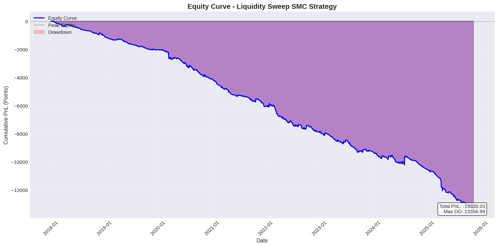
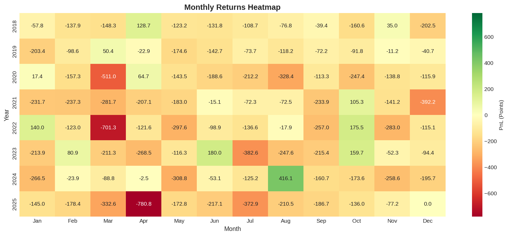
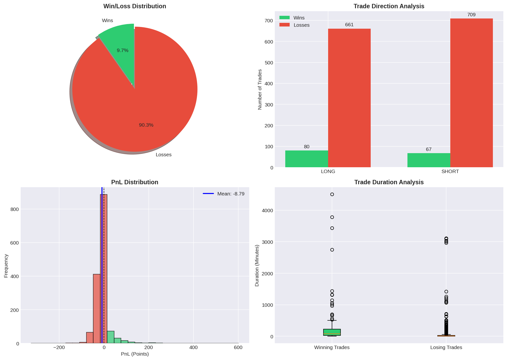
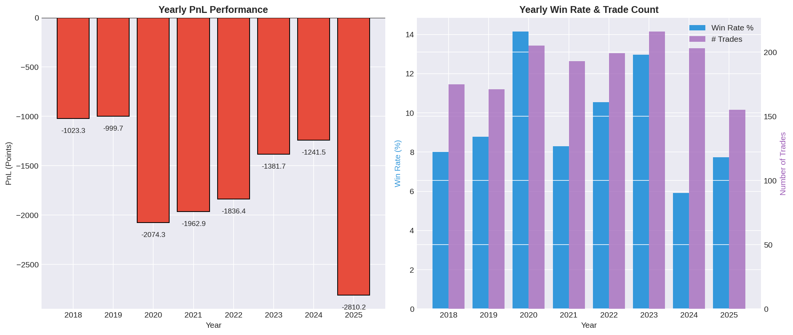
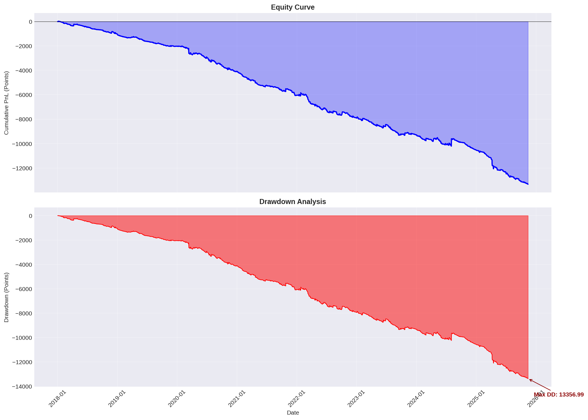

# 📊 Liquidity Sweep SMC Strategy - Backtest Report

**Generated:** 2025-11-30 22:21:05  
**Data Period:** 2018-01-02 to 2025-11-12

---

## 📋 Strategy Overview

This backtest evaluates a **Multi-Timeframe Smart Money Concepts (SMC)** strategy based on liquidity sweeps with Fair Value Gap (FVG) confirmation.

### Strategy Logic

| Timeframe | Purpose | Conditions |
|-----------|---------|------------|
| **M15** | Zone of Interest (POI) | Identify Swing Highs/Lows with 5-candle lookback. Detect liquidity sweeps (wick-only breaks that close inside range) |
| **M5** | Structure Confirmation | Within 3 candles post-sweep, identify FVG in opposite direction (institutional displacement signal) |
| **M1** | Execution | Entry on FVG fill. SL at sweep wick + 0.5 points buffer. TP at 1:3 RR |

---

## 📈 Performance Summary

### Key Metrics

| Metric | Value |
|--------|-------|
| **Total Trades** | 1517 |
| **Completed Trades** | 1517 |
| **Win Rate** | **9.69%** |
| **Profit Factor** | **0.40** |
| **Total PnL** | **-13330.01 points** |
| **Average PnL/Trade** | -8.79 points |
| **Max Drawdown** | 13356.99 points |

### Win/Loss Breakdown

| Category | Count | Percentage |
|----------|-------|------------|
| Wins | 147 | 9.7% |
| Losses | 1370 | 90.3% |
| Open Trades | 0 | - |

### Profit Analysis

| Metric | Value |
|--------|-------|
| Gross Profit | 8725.63 points |
| Gross Loss | 22055.64 points |
| Average Win | 59.36 points |
| Average Loss | 16.10 points |
| Max Consecutive Wins | 3 |
| Max Consecutive Losses | 55 |

---

## 🔄 Direction Analysis

| Direction | Trades | Win Rate | Total PnL |
|-----------|--------|----------|-----------|
| **LONG** | 741 | 10.80% | -6929.20 points |
| **SHORT** | 776 | 8.63% | -6400.81 points |

---

## 📊 Visual Analysis

### Equity Curve

The equity curve shows the cumulative profit/loss over time, with drawdown periods highlighted in red.

---

### Monthly Returns Heatmap

This heatmap visualizes monthly performance across all backtested years. Green indicates profitable months, red indicates losing months.

---

### Trade Distribution Analysis

Four key distributions: Win/Loss ratio, Long vs Short performance, PnL distribution, and trade duration analysis.

---

### Yearly Performance

Annual performance breakdown showing PnL and win rate by year.

---

### Drawdown Analysis

Detailed view of the drawdown periods and recovery.

---

## 📝 Observations & Insights

### Strengths
- ✅ LONG trades outperform with 10.8% win rate vs 8.6% for shorts

### Areas for Improvement

- ⚠️ Win rate of 9.7% is below 50%, but can still be profitable with good RR ratio
- ⚠️ Profit factor of 0.40 is below 1.0, indicating losing strategy
- ⚠️ Negative total PnL of -13330.01 points

---

## ⚙️ Strategy Parameters

| Parameter | Value |
|-----------|-------|
| Swing Lookback | 5 candles (left & right) |
| FVG Search Window | 3 M5 candles |
| Risk/Reward Ratio | 1:3 |
| Stop Loss Buffer | 0.5 points |

---

## 🚀 Recommendations

1. **Parameter Optimization**: Consider testing different swing lookback periods (3-7) and RR ratios (2-4)
2. **Time Filters**: Analyze performance by session (Asian, London, NY) to identify optimal trading windows
3. **Volatility Filter**: Add ATR-based position sizing or trade filters to adapt to market conditions
4. **Additional Confirmations**: Consider adding Order Block or Breaker Block confirmations

---

## 📁 Files Generated

| File | Description |
|------|-------------|
| `BACKTEST_REPORT.md` | This comprehensive report |
| `reports/equity_curve.png` | Equity curve visualization |
| `reports/monthly_returns.png` | Monthly returns heatmap |
| `reports/trade_distribution.png` | Trade distribution analysis |
| `reports/yearly_performance.png` | Yearly performance breakdown |
| `reports/drawdown_analysis.png` | Drawdown analysis chart |
| `backtest_trades.csv` | Detailed trade log |

---

*Report generated by Liquidity Sweep SMC Strategy Backtester*
