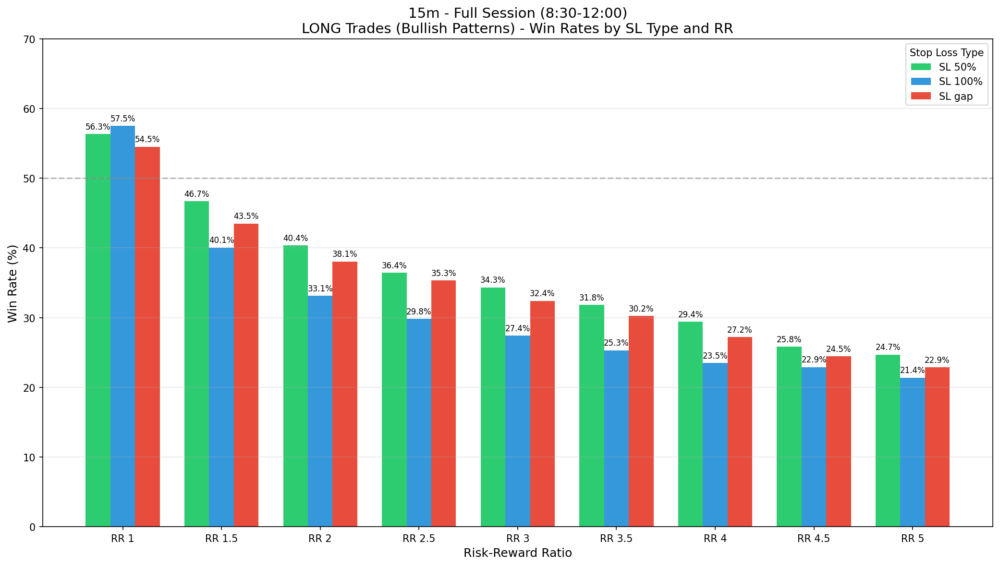
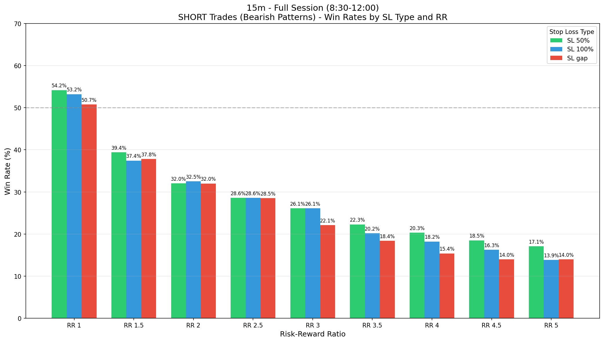
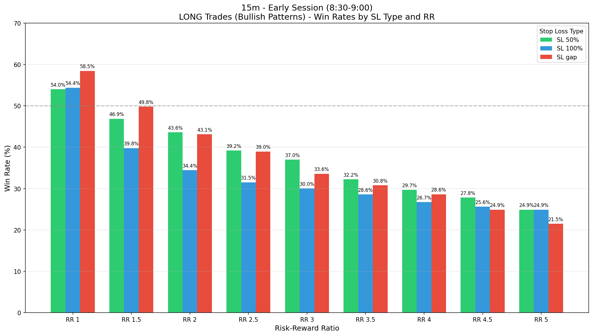
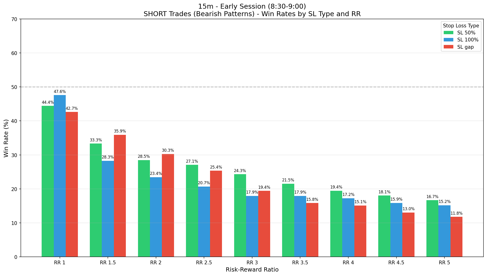
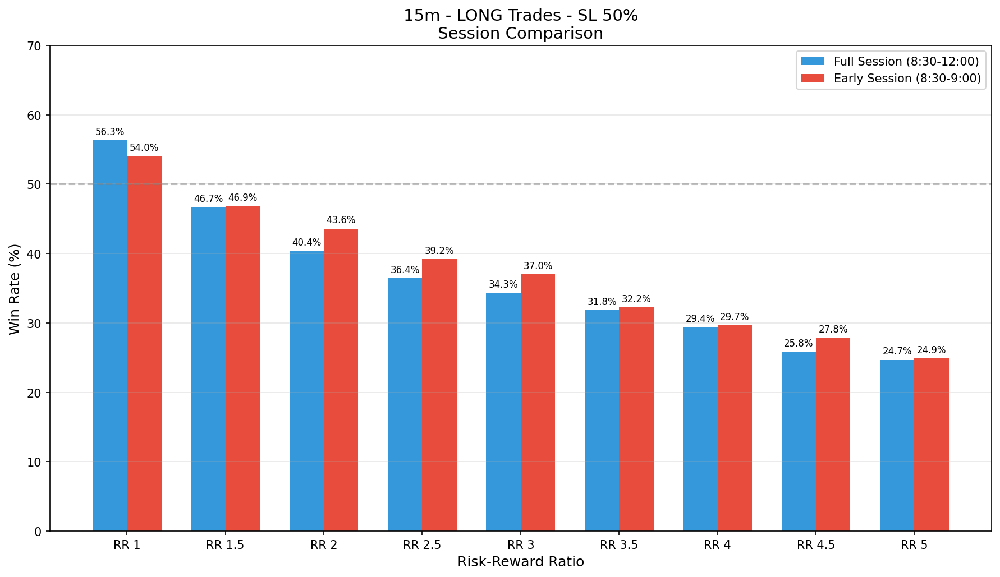
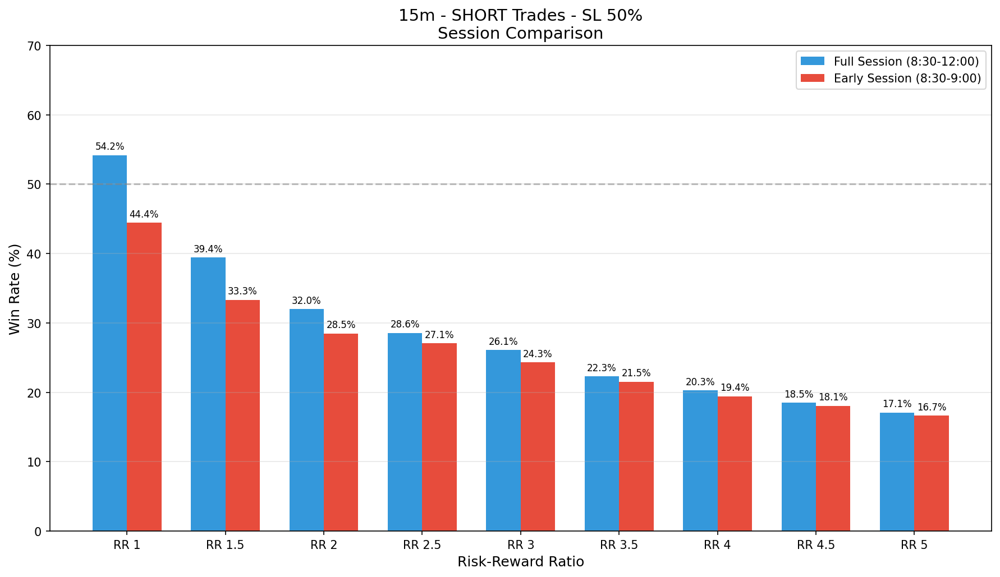

# FVG Analysis Report - 15m Timeframe

## Overview

This report analyzes **FVG (Fair Value Gap)** patterns on the **15m** timeframe from 2018 to 2025.

### Pattern Definition
- **Pattern**: FVG → Normal candle (no FVG) → FVG
- **Direction**: Both FVGs must be of the same direction (bullish-bullish or bearish-bearish)
- **FVG Definition**:
  - **Bullish FVG**: Low of candle n+1 > High of candle n-1
  - **Bearish FVG**: High of candle n+1 < Low of candle n-1

---

## Session Analysis

### Full Session (8:30 - 12:00)

| Metric | Value |
|--------|-------|
| Total Candles | 30,369 |
| Total Trading Sessions | 2,028 |
| Total FVGs | 8,422 |
| Bullish FVGs | 4,733 |
| Bearish FVGs | 3,689 |
| **FVG-Normal-FVG Patterns** | **535** |
| Bullish Patterns | 332 |
| Bearish Patterns | 203 |
| Pattern Rate | 1.76% |

### Early Session (8:30 - 9:00)

| Metric | Value |
|--------|-------|
| Total Candles | 6,084 |
| Total Trading Sessions | 2,028 |
| Total FVGs | 3,268 |
| Bullish FVGs | 1,894 |
| Bearish FVGs | 1,374 |
| **FVG-Normal-FVG Patterns** | **420** |
| Bullish Patterns | 275 |
| Bearish Patterns | 145 |
| Pattern Rate | 6.90% |

---

## Backtesting Results

### Stop Loss Types
- **SL 50%**: Stop loss at 50% of entry candle (n+1) range beyond its extreme
- **SL 100%**: Stop loss at the extreme of entry candle (n+1)
- **SL gap**: Stop loss beyond the FVG gap of the second FVG

### Risk-Reward Ratios
RR 1, RR 1.5, RR 2, RR 2.5, RR 3, RR 3.5, RR 4, RR 4.5, RR 5

---

## Full Session (8:30 - 12:00) - Win Rates

### LONG Trades (Bullish Patterns)

| SL Type | RR 1 | RR 1.5 | RR 2 | RR 2.5 | RR 3 | RR 3.5 | RR 4 | RR 4.5 | RR 5 |
|---------|------|--------|------|--------|------|--------|------|--------|------|
| 50% | 56.3% | 46.7% | 40.4% | 36.4% | 34.3% | 31.8% | 29.4% | 25.8% | 24.7% |
| 100% | 57.5% | 40.1% | 33.1% | 29.8% | 27.4% | 25.3% | 23.5% | 22.9% | 21.4% |
| gap | 54.5% | 43.5% | 38.1% | 35.3% | 32.4% | 30.2% | 27.2% | 24.5% | 22.9% |

### SHORT Trades (Bearish Patterns)

| SL Type | RR 1 | RR 1.5 | RR 2 | RR 2.5 | RR 3 | RR 3.5 | RR 4 | RR 4.5 | RR 5 |
|---------|------|--------|------|--------|------|--------|------|--------|------|
| 50% | 54.2% | 39.4% | 32.0% | 28.6% | 26.1% | 22.3% | 20.3% | 18.5% | 17.1% |
| 100% | 53.2% | 37.4% | 32.5% | 28.6% | 26.1% | 20.2% | 18.2% | 16.3% | 13.9% |
| gap | 50.7% | 37.8% | 32.0% | 28.5% | 22.1% | 18.4% | 15.4% | 14.0% | 14.0% |

### Trade Counts - Full Session

#### LONG Trades (Bullish)
| SL Type | Wins | Losses | Timeouts | Total | Win Rate |
|---------|------|--------|----------|-------|----------|
| 50% | 187 | 145 | 0 | 332 | 56.3% |
| 100% | 191 | 141 | 0 | 332 | 57.5% |
| gap | 181 | 151 | 0 | 332 | 54.5% |

#### SHORT Trades (Bearish)
| SL Type | Wins | Losses | Timeouts | Total | Win Rate |
|---------|------|--------|----------|-------|----------|
| 50% | 110 | 93 | 0 | 203 | 54.2% |
| 100% | 108 | 95 | 0 | 203 | 53.2% |
| gap | 102 | 99 | 2 | 201 | 50.7% |

---

## Early Session (8:30 - 9:00) - Win Rates

### LONG Trades (Bullish Patterns)

| SL Type | RR 1 | RR 1.5 | RR 2 | RR 2.5 | RR 3 | RR 3.5 | RR 4 | RR 4.5 | RR 5 |
|---------|------|--------|------|--------|------|--------|------|--------|------|
| 50% | 54.0% | 46.9% | 43.6% | 39.2% | 37.0% | 32.2% | 29.7% | 27.8% | 24.9% |
| 100% | 54.4% | 39.8% | 34.4% | 31.5% | 30.0% | 28.6% | 26.7% | 25.6% | 24.9% |
| gap | 58.5% | 49.8% | 43.1% | 39.0% | 33.6% | 30.8% | 28.6% | 24.9% | 21.5% |

### SHORT Trades (Bearish Patterns)

| SL Type | RR 1 | RR 1.5 | RR 2 | RR 2.5 | RR 3 | RR 3.5 | RR 4 | RR 4.5 | RR 5 |
|---------|------|--------|------|--------|------|--------|------|--------|------|
| 50% | 44.4% | 33.3% | 28.5% | 27.1% | 24.3% | 21.5% | 19.4% | 18.1% | 16.7% |
| 100% | 47.6% | 28.3% | 23.4% | 20.7% | 17.9% | 17.9% | 17.2% | 15.9% | 15.2% |
| gap | 42.7% | 35.9% | 30.3% | 25.4% | 19.4% | 15.8% | 15.1% | 13.0% | 11.8% |

---

## Charts

### Full Session Win Rates

#### LONG Trades

#### SHORT Trades

### Early Session Win Rates

#### LONG Trades

#### SHORT Trades

### Session Comparison

#### LONG Trades - SL 50%

#### SHORT Trades - SL 50%

---

## Key Findings

1. **Pattern Rate**: The FVG-Normal-FVG pattern occurs more frequently during the early session (8:30-9:00) compared to the full session.

2. **Win Rates**: 
   - Win rates decrease as RR increases (as expected)
   - SL 50% generally provides the best balance for higher RR trades
   - SL 100% tends to have higher win rates at RR 1, but lower at higher RRs

3. **Session Comparison**:
   - Early session often shows slightly better win rates due to higher volatility
   - Pattern occurrence is more concentrated in the first 30 minutes

---

*Report generated from FVG Analysis Script*
*Data: 2018-2025*
