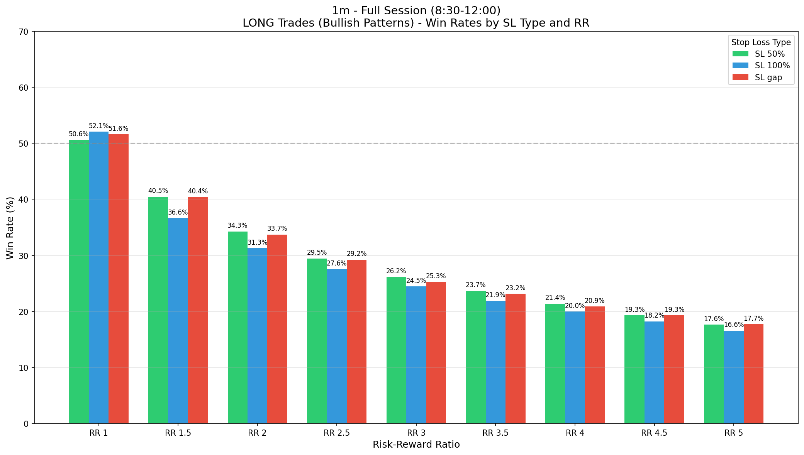
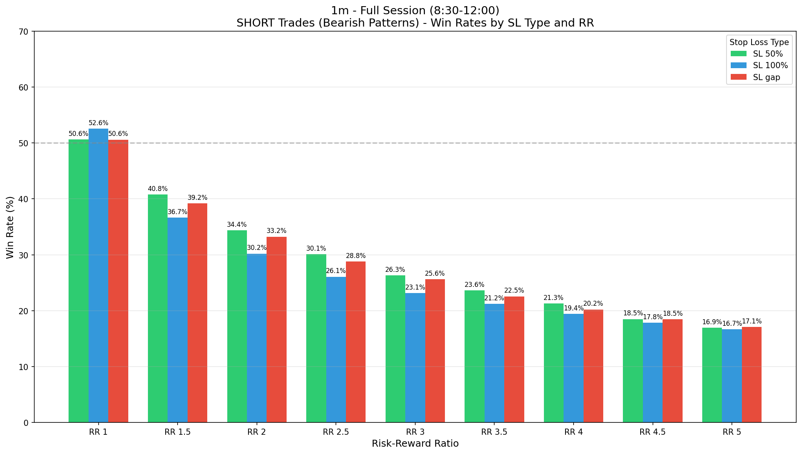
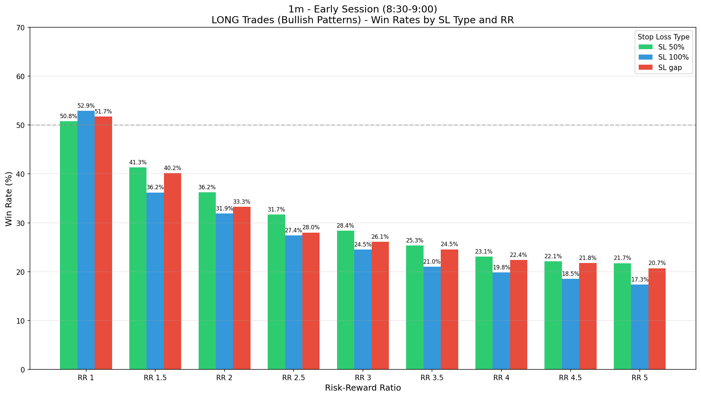
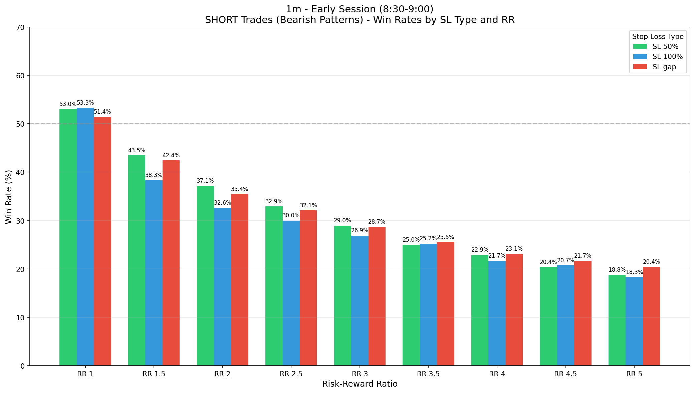
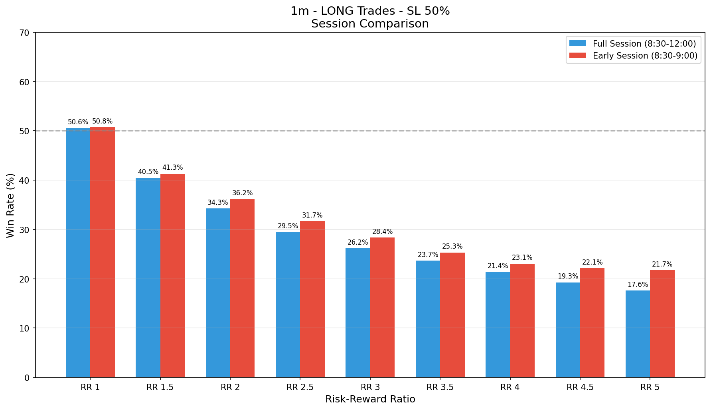
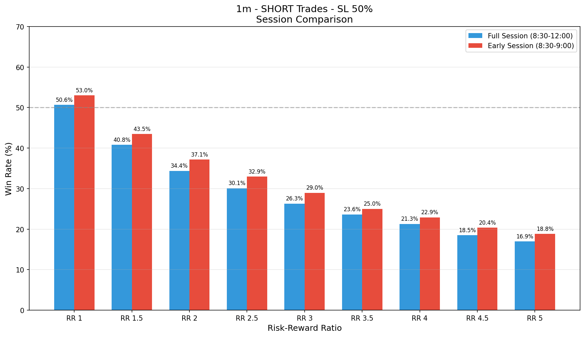

# FVG Analysis Report - 1m Timeframe

## Overview

This report analyzes **FVG (Fair Value Gap)** patterns on the **1m** timeframe from 2018 to 2025.

### Pattern Definition
- **Pattern**: FVG → Normal candle (no FVG) → FVG
- **Direction**: Both FVGs must be of the same direction (bullish-bullish or bearish-bearish)
- **FVG Definition**:
  - **Bullish FVG**: Low of candle n+1 > High of candle n-1
  - **Bearish FVG**: High of candle n+1 < Low of candle n-1

---

## Session Analysis

### Full Session (8:30 - 12:00)

| Metric | Value |
|--------|-------|
| Total Candles | 428,001 |
| Total Trading Sessions | 2,029 |
| Total FVGs | 90,473 |
| Bullish FVGs | 47,609 |
| Bearish FVGs | 42,864 |
| **FVG-Normal-FVG Patterns** | **4,948** |
| Bullish Patterns | 2,712 |
| Bearish Patterns | 2,236 |
| Pattern Rate | 1.16% |

### Early Session (8:30 - 9:00)

| Metric | Value |
|--------|-------|
| Total Candles | 62,848 |
| Total Trading Sessions | 2,029 |
| Total FVGs | 16,159 |
| Bullish FVGs | 8,609 |
| Bearish FVGs | 7,550 |
| **FVG-Normal-FVG Patterns** | **958** |
| Bullish Patterns | 530 |
| Bearish Patterns | 428 |
| Pattern Rate | 1.52% |

---

## Backtesting Results

### Stop Loss Types
- **SL 50%**: Stop loss at 50% of entry candle (n+1) range beyond its extreme
- **SL 100%**: Stop loss at the extreme of entry candle (n+1)
- **SL gap**: Stop loss beyond the FVG gap of the second FVG

### Risk-Reward Ratios
RR 1, RR 1.5, RR 2, RR 2.5, RR 3, RR 3.5, RR 4, RR 4.5, RR 5

---

## Full Session (8:30 - 12:00) - Win Rates

### LONG Trades (Bullish Patterns)

| SL Type | RR 1 | RR 1.5 | RR 2 | RR 2.5 | RR 3 | RR 3.5 | RR 4 | RR 4.5 | RR 5 |
|---------|------|--------|------|--------|------|--------|------|--------|------|
| 50% | 50.6% | 40.5% | 34.3% | 29.5% | 26.2% | 23.7% | 21.4% | 19.3% | 17.6% |
| 100% | 52.1% | 36.6% | 31.3% | 27.6% | 24.5% | 21.9% | 20.0% | 18.2% | 16.6% |
| gap | 51.6% | 40.4% | 33.7% | 29.2% | 25.3% | 23.2% | 20.9% | 19.3% | 17.7% |

### SHORT Trades (Bearish Patterns)

| SL Type | RR 1 | RR 1.5 | RR 2 | RR 2.5 | RR 3 | RR 3.5 | RR 4 | RR 4.5 | RR 5 |
|---------|------|--------|------|--------|------|--------|------|--------|------|
| 50% | 50.6% | 40.8% | 34.4% | 30.1% | 26.3% | 23.6% | 21.3% | 18.5% | 16.9% |
| 100% | 52.6% | 36.7% | 30.2% | 26.1% | 23.1% | 21.2% | 19.4% | 17.8% | 16.7% |
| gap | 50.6% | 39.2% | 33.2% | 28.8% | 25.6% | 22.5% | 20.2% | 18.5% | 17.1% |

### Trade Counts - Full Session

#### LONG Trades (Bullish)
| SL Type | Wins | Losses | Timeouts | Total | Win Rate |
|---------|------|--------|----------|-------|----------|
| 50% | 1371 | 1338 | 3 | 2709 | 50.6% |
| 100% | 1392 | 1282 | 0 | 2674 | 52.1% |
| gap | 1377 | 1291 | 44 | 2668 | 51.6% |

#### SHORT Trades (Bearish)
| SL Type | Wins | Losses | Timeouts | Total | Win Rate |
|---------|------|--------|----------|-------|----------|
| 50% | 1131 | 1102 | 2 | 2233 | 50.6% |
| 100% | 1156 | 1043 | 1 | 2199 | 52.6% |
| gap | 1119 | 1093 | 24 | 2212 | 50.6% |

---

## Early Session (8:30 - 9:00) - Win Rates

### LONG Trades (Bullish Patterns)

| SL Type | RR 1 | RR 1.5 | RR 2 | RR 2.5 | RR 3 | RR 3.5 | RR 4 | RR 4.5 | RR 5 |
|---------|------|--------|------|--------|------|--------|------|--------|------|
| 50% | 50.8% | 41.3% | 36.2% | 31.7% | 28.4% | 25.3% | 23.1% | 22.1% | 21.7% |
| 100% | 52.9% | 36.2% | 31.9% | 27.4% | 24.5% | 21.0% | 19.8% | 18.5% | 17.3% |
| gap | 51.7% | 40.2% | 33.3% | 28.0% | 26.1% | 24.5% | 22.4% | 21.8% | 20.7% |

### SHORT Trades (Bearish Patterns)

| SL Type | RR 1 | RR 1.5 | RR 2 | RR 2.5 | RR 3 | RR 3.5 | RR 4 | RR 4.5 | RR 5 |
|---------|------|--------|------|--------|------|--------|------|--------|------|
| 50% | 53.0% | 43.5% | 37.1% | 32.9% | 29.0% | 25.0% | 22.9% | 20.4% | 18.8% |
| 100% | 53.3% | 38.3% | 32.6% | 30.0% | 26.9% | 25.2% | 21.7% | 20.7% | 18.3% |
| gap | 51.4% | 42.4% | 35.4% | 32.1% | 28.7% | 25.5% | 23.1% | 21.7% | 20.4% |

---

## Charts

### Full Session Win Rates

#### LONG Trades

#### SHORT Trades

### Early Session Win Rates

#### LONG Trades

#### SHORT Trades

### Session Comparison

#### LONG Trades - SL 50%

#### SHORT Trades - SL 50%

---

## Key Findings

1. **Pattern Rate**: The FVG-Normal-FVG pattern occurs more frequently during the early session (8:30-9:00) compared to the full session.

2. **Win Rates**: 
   - Win rates decrease as RR increases (as expected)
   - SL 50% generally provides the best balance for higher RR trades
   - SL 100% tends to have higher win rates at RR 1, but lower at higher RRs

3. **Session Comparison**:
   - Early session often shows slightly better win rates due to higher volatility
   - Pattern occurrence is more concentrated in the first 30 minutes

---

*Report generated from FVG Analysis Script*
*Data: 2018-2025*
