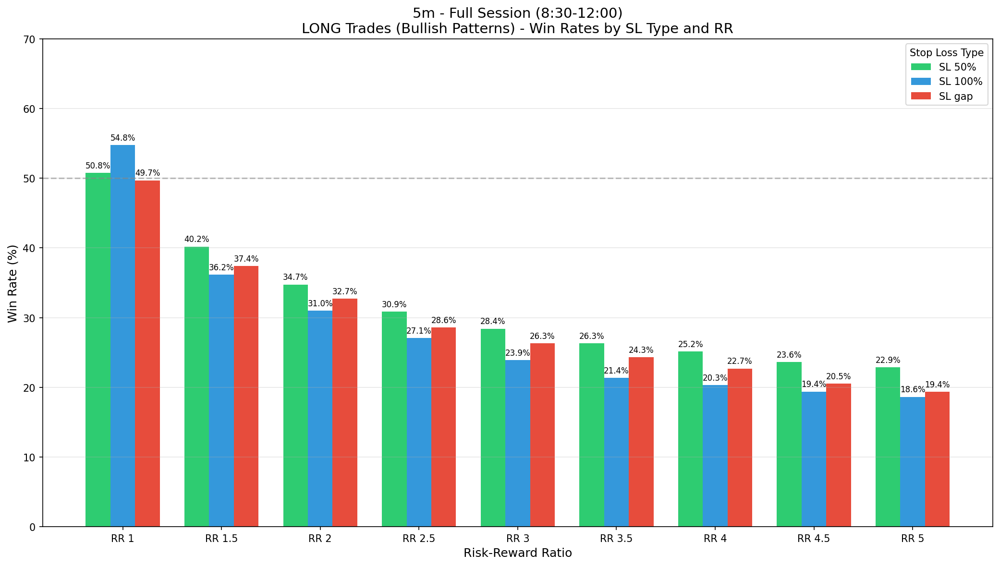
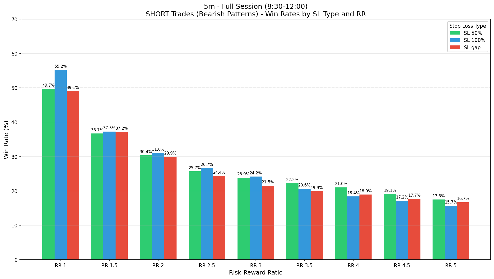
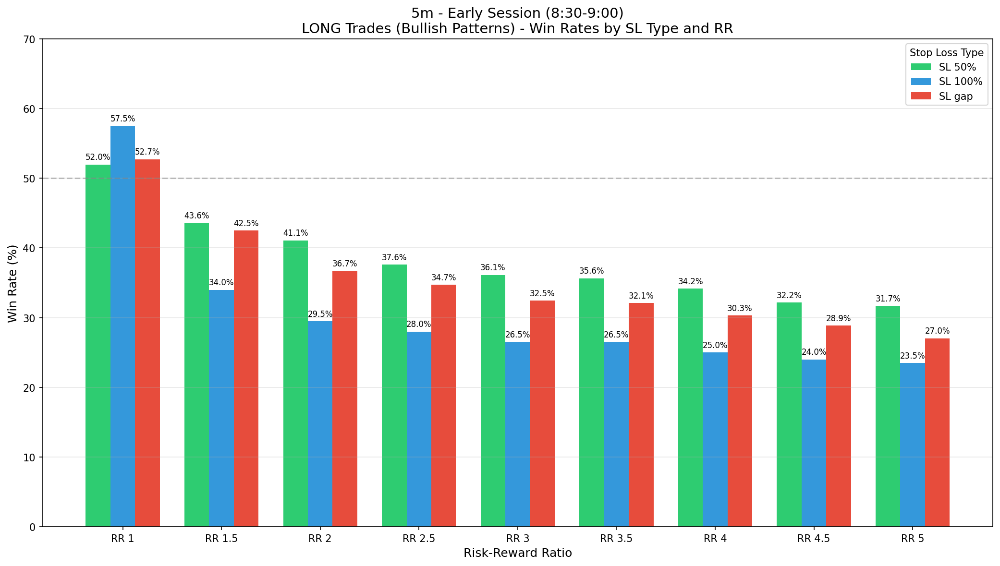
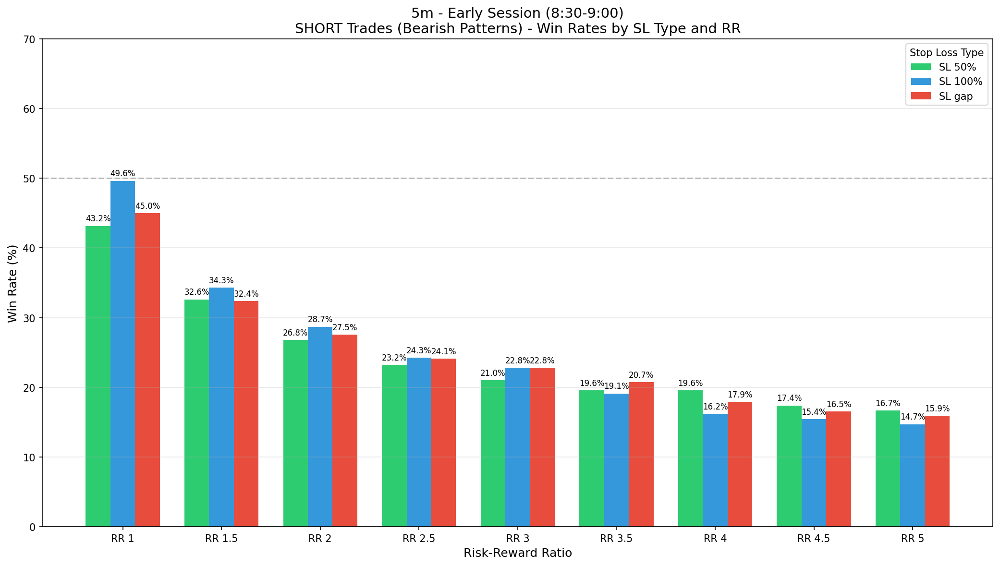
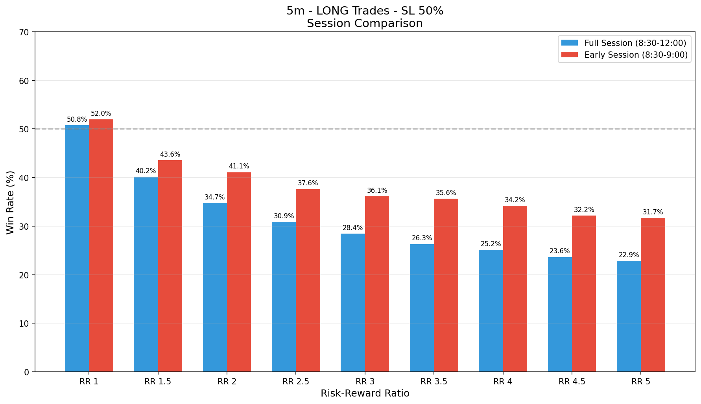
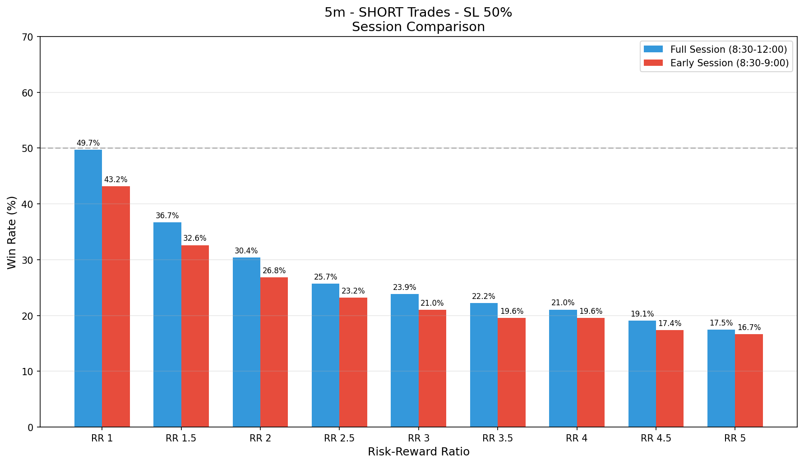

# FVG Analysis Report - 5m Timeframe

## Overview

This report analyzes **FVG (Fair Value Gap)** patterns on the **5m** timeframe from 2018 to 2025.

### Pattern Definition
- **Pattern**: FVG → Normal candle (no FVG) → FVG
- **Direction**: Both FVGs must be of the same direction (bullish-bullish or bearish-bearish)
- **FVG Definition**:
  - **Bullish FVG**: Low of candle n+1 > High of candle n-1
  - **Bearish FVG**: High of candle n+1 < Low of candle n-1

---

## Session Analysis

### Full Session (8:30 - 12:00)

| Metric | Value |
|--------|-------|
| Total Candles | 87,145 |
| Total Trading Sessions | 2,028 |
| Total FVGs | 20,485 |
| Bullish FVGs | 11,133 |
| Bearish FVGs | 9,352 |
| **FVG-Normal-FVG Patterns** | **1,149** |
| Bullish Patterns | 664 |
| Bearish Patterns | 485 |
| Pattern Rate | 1.32% |

### Early Session (8:30 - 9:00)

| Metric | Value |
|--------|-------|
| Total Candles | 14,190 |
| Total Trading Sessions | 2,028 |
| Total FVGs | 5,539 |
| Bullish FVGs | 3,095 |
| Bearish FVGs | 2,444 |
| **FVG-Normal-FVG Patterns** | **342** |
| Bullish Patterns | 202 |
| Bearish Patterns | 140 |
| Pattern Rate | 2.41% |

---

## Backtesting Results

### Stop Loss Types
- **SL 50%**: Stop loss at 50% of entry candle (n+1) range beyond its extreme
- **SL 100%**: Stop loss at the extreme of entry candle (n+1)
- **SL gap**: Stop loss beyond the FVG gap of the second FVG

### Risk-Reward Ratios
RR 1, RR 1.5, RR 2, RR 2.5, RR 3, RR 3.5, RR 4, RR 4.5, RR 5

---

## Full Session (8:30 - 12:00) - Win Rates

### LONG Trades (Bullish Patterns)

| SL Type | RR 1 | RR 1.5 | RR 2 | RR 2.5 | RR 3 | RR 3.5 | RR 4 | RR 4.5 | RR 5 |
|---------|------|--------|------|--------|------|--------|------|--------|------|
| 50% | 50.8% | 40.2% | 34.7% | 30.9% | 28.4% | 26.3% | 25.2% | 23.6% | 22.9% |
| 100% | 54.8% | 36.2% | 31.0% | 27.1% | 23.9% | 21.4% | 20.3% | 19.4% | 18.6% |
| gap | 49.7% | 37.4% | 32.7% | 28.6% | 26.3% | 24.3% | 22.7% | 20.5% | 19.4% |

### SHORT Trades (Bearish Patterns)

| SL Type | RR 1 | RR 1.5 | RR 2 | RR 2.5 | RR 3 | RR 3.5 | RR 4 | RR 4.5 | RR 5 |
|---------|------|--------|------|--------|------|--------|------|--------|------|
| 50% | 49.7% | 36.7% | 30.4% | 25.7% | 23.9% | 22.2% | 21.0% | 19.1% | 17.5% |
| 100% | 55.2% | 37.3% | 31.0% | 26.7% | 24.2% | 20.6% | 18.4% | 17.2% | 15.7% |
| gap | 49.1% | 37.2% | 29.9% | 24.4% | 21.5% | 19.9% | 18.9% | 17.7% | 16.7% |

### Trade Counts - Full Session

#### LONG Trades (Bullish)
| SL Type | Wins | Losses | Timeouts | Total | Win Rate |
|---------|------|--------|----------|-------|----------|
| 50% | 337 | 327 | 0 | 664 | 50.8% |
| 100% | 362 | 299 | 0 | 661 | 54.8% |
| gap | 325 | 329 | 10 | 654 | 49.7% |

#### SHORT Trades (Bearish)
| SL Type | Wins | Losses | Timeouts | Total | Win Rate |
|---------|------|--------|----------|-------|----------|
| 50% | 241 | 244 | 0 | 485 | 49.7% |
| 100% | 265 | 215 | 0 | 480 | 55.2% |
| gap | 236 | 245 | 4 | 481 | 49.1% |

---

## Early Session (8:30 - 9:00) - Win Rates

### LONG Trades (Bullish Patterns)

| SL Type | RR 1 | RR 1.5 | RR 2 | RR 2.5 | RR 3 | RR 3.5 | RR 4 | RR 4.5 | RR 5 |
|---------|------|--------|------|--------|------|--------|------|--------|------|
| 50% | 52.0% | 43.6% | 41.1% | 37.6% | 36.1% | 35.6% | 34.2% | 32.2% | 31.7% |
| 100% | 57.5% | 34.0% | 29.5% | 28.0% | 26.5% | 26.5% | 25.0% | 24.0% | 23.5% |
| gap | 52.7% | 42.5% | 36.7% | 34.7% | 32.5% | 32.1% | 30.3% | 28.9% | 27.0% |

### SHORT Trades (Bearish Patterns)

| SL Type | RR 1 | RR 1.5 | RR 2 | RR 2.5 | RR 3 | RR 3.5 | RR 4 | RR 4.5 | RR 5 |
|---------|------|--------|------|--------|------|--------|------|--------|------|
| 50% | 43.2% | 32.6% | 26.8% | 23.2% | 21.0% | 19.6% | 19.6% | 17.4% | 16.7% |
| 100% | 49.6% | 34.3% | 28.7% | 24.3% | 22.8% | 19.1% | 16.2% | 15.4% | 14.7% |
| gap | 45.0% | 32.4% | 27.5% | 24.1% | 22.8% | 20.7% | 17.9% | 16.5% | 15.9% |

---

## Charts

### Full Session Win Rates

#### LONG Trades

#### SHORT Trades

### Early Session Win Rates

#### LONG Trades

#### SHORT Trades

### Session Comparison

#### LONG Trades - SL 50%

#### SHORT Trades - SL 50%

---

## Key Findings

1. **Pattern Rate**: The FVG-Normal-FVG pattern occurs more frequently during the early session (8:30-9:00) compared to the full session.

2. **Win Rates**: 
   - Win rates decrease as RR increases (as expected)
   - SL 50% generally provides the best balance for higher RR trades
   - SL 100% tends to have higher win rates at RR 1, but lower at higher RRs

3. **Session Comparison**:
   - Early session often shows slightly better win rates due to higher volatility
   - Pattern occurrence is more concentrated in the first 30 minutes

---

*Report generated from FVG Analysis Script*
*Data: 2018-2025*
