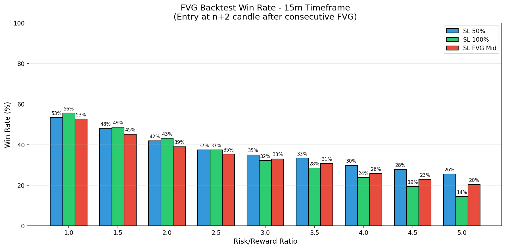

# FVG Backtest Analysis - 15m Timeframe

## Strategy Overview

- **Entry Time**: 09:15 (Opening of n+2 candle after second FVG)
- **Direction**: Same as consecutive FVG direction (bullish or bearish)
- **Total Consecutive FVG Opportunities**: 227

## Stop Loss Configurations

1. **SL 50%**: 50% of the n+2 candle range from entry
2. **SL 100%**: 100% of the n+2 candle range from entry  
3. **SL FVG Mid**: Middle of the second FVG candle

---

## Win Rate Results

### SL at 50% of n+2 Candle

| RR | Wins | Losses | Pending | Total | Win Rate |
|:--:|:----:|:------:|:-------:|:-----:|:--------:|
| 1.0 | 121 | 106 | 0 | 227 | **53.3%** |
| 1.5 | 109 | 118 | 0 | 227 | **48.0%** |
| 2.0 | 95 | 132 | 0 | 227 | **41.9%** |
| 2.5 | 85 | 142 | 0 | 227 | **37.4%** |
| 3.0 | 79 | 147 | 1 | 226 | **35.0%** |
| 3.5 | 74 | 148 | 5 | 222 | **33.3%** |
| 4.0 | 65 | 153 | 9 | 218 | **29.8%** |
| 4.5 | 60 | 156 | 11 | 216 | **27.8%** |
| 5.0 | 55 | 160 | 12 | 215 | **25.6%** |

### SL at 100% of n+2 Candle

| RR | Wins | Losses | Pending | Total | Win Rate |
|:--:|:----:|:------:|:-------:|:-----:|:--------:|
| 1.0 | 124 | 99 | 4 | 223 | **55.6%** |
| 1.5 | 107 | 113 | 7 | 220 | **48.6%** |
| 2.0 | 91 | 120 | 16 | 211 | **43.1%** |
| 2.5 | 76 | 127 | 24 | 203 | **37.4%** |
| 3.0 | 63 | 133 | 31 | 196 | **32.1%** |
| 3.5 | 53 | 133 | 41 | 186 | **28.5%** |
| 4.0 | 42 | 135 | 50 | 177 | **23.7%** |
| 4.5 | 33 | 137 | 57 | 170 | **19.4%** |
| 5.0 | 23 | 137 | 67 | 160 | **14.4%** |

### SL at Middle of Second FVG

| RR | Wins | Losses | Pending | Total | Win Rate |
|:--:|:----:|:------:|:-------:|:-----:|:--------:|
| 1.0 | 118 | 106 | 3 | 224 | **52.7%** |
| 1.5 | 98 | 119 | 10 | 217 | **45.2%** |
| 2.0 | 80 | 125 | 22 | 205 | **39.0%** |
| 2.5 | 70 | 128 | 29 | 198 | **35.4%** |
| 3.0 | 64 | 130 | 33 | 194 | **33.0%** |
| 3.5 | 58 | 131 | 38 | 189 | **30.7%** |
| 4.0 | 47 | 135 | 45 | 182 | **25.8%** |
| 4.5 | 40 | 135 | 52 | 175 | **22.9%** |
| 5.0 | 35 | 137 | 55 | 172 | **20.3%** |

---

## Summary Table - All SL Types

| SL Type | RR 1.0 | RR 1.5 | RR 2.0 | RR 2.5 | RR 3.0 | RR 3.5 | RR 4.0 | RR 4.5 | RR 5.0 |
|:--------|:------:|:------:|:------:|:------:|:------:|:------:|:------:|:------:|:------:|
| SL 50% | 53.3% | 48.0% | 41.9% | 37.4% | 35.0% | 33.3% | 29.8% | 27.8% | 25.6% |
| SL 100% | 55.6% | 48.6% | 43.1% | 37.4% | 32.1% | 28.5% | 23.7% | 19.4% | 14.4% |
| SL FVG Mid | 52.7% | 45.2% | 39.0% | 35.4% | 33.0% | 30.7% | 25.8% | 22.9% | 20.3% |

---

## Charts

### Win Rate by Risk/Reward Ratio

### Trade Distribution by Direction

The strategy was applied to:
- **Bullish FVG patterns**: Long positions
- **Bearish FVG patterns**: Short positions

---

*Generated on 2025-11-30 11:51:09*
