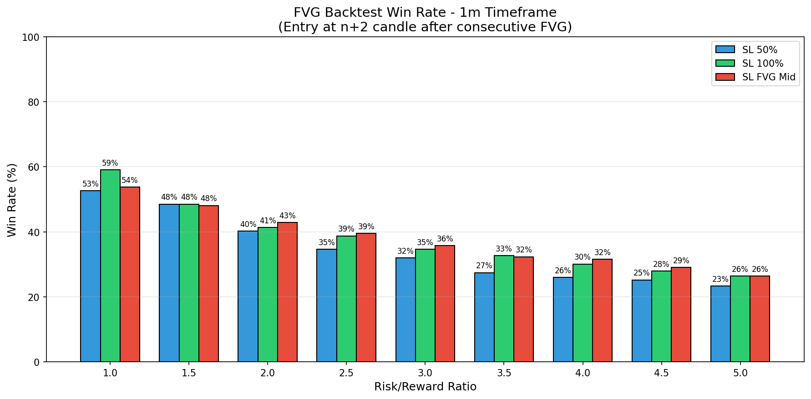

# FVG Backtest Analysis - 1m Timeframe

## Strategy Overview

- **Entry Time**: 08:33 (Opening of n+2 candle after second FVG)
- **Direction**: Same as consecutive FVG direction (bullish or bearish)
- **Total Consecutive FVG Opportunities**: 266

## Stop Loss Configurations

1. **SL 50%**: 50% of the n+2 candle range from entry
2. **SL 100%**: 100% of the n+2 candle range from entry  
3. **SL FVG Mid**: Middle of the second FVG candle

---

## Win Rate Results

### SL at 50% of n+2 Candle

| RR | Wins | Losses | Pending | Total | Win Rate |
|:--:|:----:|:------:|:-------:|:-----:|:--------:|
| 1.0 | 140 | 126 | 0 | 266 | **52.6%** |
| 1.5 | 129 | 137 | 0 | 266 | **48.5%** |
| 2.0 | 107 | 159 | 0 | 266 | **40.2%** |
| 2.5 | 92 | 174 | 0 | 266 | **34.6%** |
| 3.0 | 85 | 181 | 0 | 266 | **32.0%** |
| 3.5 | 73 | 193 | 0 | 266 | **27.4%** |
| 4.0 | 69 | 197 | 0 | 266 | **25.9%** |
| 4.5 | 67 | 199 | 0 | 266 | **25.2%** |
| 5.0 | 62 | 204 | 0 | 266 | **23.3%** |

### SL at 100% of n+2 Candle

| RR | Wins | Losses | Pending | Total | Win Rate |
|:--:|:----:|:------:|:-------:|:-----:|:--------:|
| 1.0 | 157 | 109 | 0 | 266 | **59.0%** |
| 1.5 | 129 | 137 | 0 | 266 | **48.5%** |
| 2.0 | 110 | 156 | 0 | 266 | **41.4%** |
| 2.5 | 103 | 163 | 0 | 266 | **38.7%** |
| 3.0 | 92 | 174 | 0 | 266 | **34.6%** |
| 3.5 | 87 | 179 | 0 | 266 | **32.7%** |
| 4.0 | 80 | 186 | 0 | 266 | **30.1%** |
| 4.5 | 74 | 191 | 1 | 265 | **27.9%** |
| 5.0 | 70 | 195 | 1 | 265 | **26.4%** |

### SL at Middle of Second FVG

| RR | Wins | Losses | Pending | Total | Win Rate |
|:--:|:----:|:------:|:-------:|:-----:|:--------:|
| 1.0 | 143 | 123 | 0 | 266 | **53.8%** |
| 1.5 | 128 | 138 | 0 | 266 | **48.1%** |
| 2.0 | 114 | 152 | 0 | 266 | **42.9%** |
| 2.5 | 105 | 161 | 0 | 266 | **39.5%** |
| 3.0 | 95 | 171 | 0 | 266 | **35.7%** |
| 3.5 | 86 | 180 | 0 | 266 | **32.3%** |
| 4.0 | 84 | 182 | 0 | 266 | **31.6%** |
| 4.5 | 77 | 188 | 1 | 265 | **29.1%** |
| 5.0 | 70 | 195 | 1 | 265 | **26.4%** |

---

## Summary Table - All SL Types

| SL Type | RR 1.0 | RR 1.5 | RR 2.0 | RR 2.5 | RR 3.0 | RR 3.5 | RR 4.0 | RR 4.5 | RR 5.0 |
|:--------|:------:|:------:|:------:|:------:|:------:|:------:|:------:|:------:|:------:|
| SL 50% | 52.6% | 48.5% | 40.2% | 34.6% | 32.0% | 27.4% | 25.9% | 25.2% | 23.3% |
| SL 100% | 59.0% | 48.5% | 41.4% | 38.7% | 34.6% | 32.7% | 30.1% | 27.9% | 26.4% |
| SL FVG Mid | 53.8% | 48.1% | 42.9% | 39.5% | 35.7% | 32.3% | 31.6% | 29.1% | 26.4% |

---

## Charts

### Win Rate by Risk/Reward Ratio

### Trade Distribution by Direction

The strategy was applied to:
- **Bullish FVG patterns**: Long positions
- **Bearish FVG patterns**: Short positions

---

*Generated on 2025-11-30 11:51:09*
