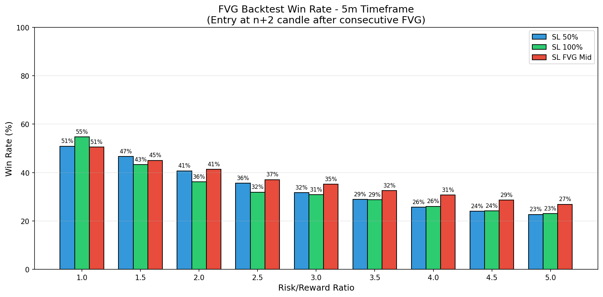

# FVG Backtest Analysis - 5m Timeframe

## Strategy Overview

- **Entry Time**: 08:45 (Opening of n+2 candle after second FVG)
- **Direction**: Same as consecutive FVG direction (bullish or bearish)
- **Total Consecutive FVG Opportunities**: 285

## Stop Loss Configurations

1. **SL 50%**: 50% of the n+2 candle range from entry
2. **SL 100%**: 100% of the n+2 candle range from entry  
3. **SL FVG Mid**: Middle of the second FVG candle

---

## Win Rate Results

### SL at 50% of n+2 Candle

| RR | Wins | Losses | Pending | Total | Win Rate |
|:--:|:----:|:------:|:-------:|:-----:|:--------:|
| 1.0 | 145 | 140 | 0 | 285 | **50.9%** |
| 1.5 | 133 | 152 | 0 | 285 | **46.7%** |
| 2.0 | 116 | 169 | 0 | 285 | **40.7%** |
| 2.5 | 101 | 183 | 1 | 284 | **35.6%** |
| 3.0 | 90 | 194 | 1 | 284 | **31.7%** |
| 3.5 | 82 | 202 | 1 | 284 | **28.9%** |
| 4.0 | 73 | 211 | 1 | 284 | **25.7%** |
| 4.5 | 68 | 215 | 2 | 283 | **24.0%** |
| 5.0 | 64 | 218 | 3 | 282 | **22.7%** |

### SL at 100% of n+2 Candle

| RR | Wins | Losses | Pending | Total | Win Rate |
|:--:|:----:|:------:|:-------:|:-----:|:--------:|
| 1.0 | 156 | 129 | 0 | 285 | **54.7%** |
| 1.5 | 123 | 161 | 1 | 284 | **43.3%** |
| 2.0 | 102 | 180 | 3 | 282 | **36.2%** |
| 2.5 | 89 | 190 | 6 | 279 | **31.9%** |
| 3.0 | 86 | 193 | 6 | 279 | **30.8%** |
| 3.5 | 79 | 196 | 10 | 275 | **28.7%** |
| 4.0 | 70 | 199 | 16 | 269 | **26.0%** |
| 4.5 | 64 | 201 | 20 | 265 | **24.2%** |
| 5.0 | 60 | 201 | 24 | 261 | **23.0%** |

### SL at Middle of Second FVG

| RR | Wins | Losses | Pending | Total | Win Rate |
|:--:|:----:|:------:|:-------:|:-----:|:--------:|
| 1.0 | 144 | 141 | 0 | 285 | **50.5%** |
| 1.5 | 127 | 155 | 3 | 282 | **45.0%** |
| 2.0 | 116 | 165 | 4 | 281 | **41.3%** |
| 2.5 | 103 | 175 | 7 | 278 | **37.1%** |
| 3.0 | 97 | 179 | 9 | 276 | **35.1%** |
| 3.5 | 89 | 185 | 11 | 274 | **32.5%** |
| 4.0 | 83 | 187 | 15 | 270 | **30.7%** |
| 4.5 | 76 | 190 | 19 | 266 | **28.6%** |
| 5.0 | 71 | 193 | 21 | 264 | **26.9%** |

---

## Summary Table - All SL Types

| SL Type | RR 1.0 | RR 1.5 | RR 2.0 | RR 2.5 | RR 3.0 | RR 3.5 | RR 4.0 | RR 4.5 | RR 5.0 |
|:--------|:------:|:------:|:------:|:------:|:------:|:------:|:------:|:------:|:------:|
| SL 50% | 50.9% | 46.7% | 40.7% | 35.6% | 31.7% | 28.9% | 25.7% | 24.0% | 22.7% |
| SL 100% | 54.7% | 43.3% | 36.2% | 31.9% | 30.8% | 28.7% | 26.0% | 24.2% | 23.0% |
| SL FVG Mid | 50.5% | 45.0% | 41.3% | 37.1% | 35.1% | 32.5% | 30.7% | 28.6% | 26.9% |

---

## Charts

### Win Rate by Risk/Reward Ratio

### Trade Distribution by Direction

The strategy was applied to:
- **Bullish FVG patterns**: Long positions
- **Bearish FVG patterns**: Short positions

---

*Generated on 2025-11-30 11:51:09*
