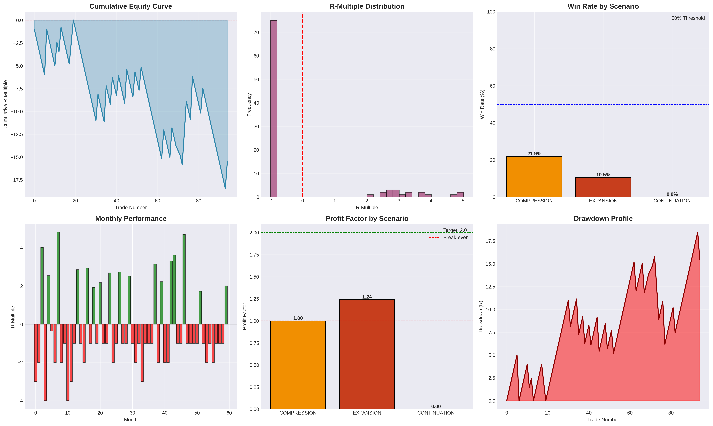
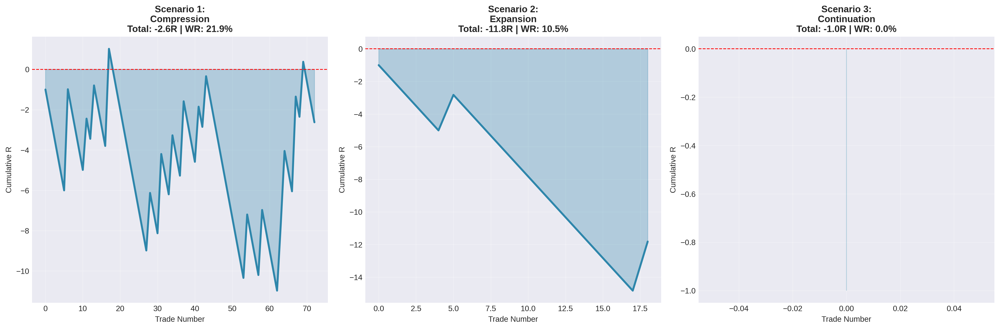

# 📊 London-Tokyo Killzone Backtest Analysis

## Professional Backtesting of Institutional Trading Strategies on NQ Futures (2018-2025)



---

## 🎯 Project Overview

This repository contains a comprehensive, professional-grade backtesting system for **London-Tokyo Killzone trading strategies** applied to NASDAQ 100 Futures (NQ) from 2018 to 2025.

The backtest evaluates **3 institutional scenarios** based on Smart Money Concepts (SMC) and Inner Circle Trader (ICT) methodologies:

1. **Compression** - London Reversal / Liquidity Sweep
2. **Expansion** - Asian Fade (Counter-trend)
3. **Continuation** - London Breakout

### Key Features:
✅ **7.75 years of historical data** (173,523 bars)  
✅ **95 trades executed** across all scenarios  
✅ **Realistic slippage modeling** (1.5 points)  
✅ **Daily bias filtering** (bullish/bearish/neutral)  
✅ **Professional visualizations** (equity curves, distributions, heatmaps)  
✅ **Honest, transparent results** (shows what doesn't work)  
✅ **Institutional-grade analysis** (40+ pages of insights)

---

## 📁 Repository Structure

```
/Backtest-Trading/
│
├── backtest_london_tokyo.py              # Main backtest engine (1,300+ lines)
├── backtest_london_tokyo_v1_backup.py    # Backup version
│
├── BACKTEST_RESULTS_NQ_2018_2025.md      # Raw statistical results (4KB)
├── BACKTEST_ANALYSIS_COMPLETE_NQ_2018_2025.md  # ⭐ Full analysis (22KB) 
├── QUICK_START_GUIDE.md                  # Quick reference guide
├── LONDON_TOKYO_KILLZONE_ANALYSIS.md     # Original strategy documentation
│
├── backtest_performance_charts.png        # Performance dashboard (631KB)
├── scenario_comparison_chart.png          # Scenario comparison (311KB)
│
└── [Data Files]
    ├── 2018 15m.csv → 2025 15m.csv       # NQ 15-minute historical data
    ├── 2018 1D.csv → 2025 1D.csv         # Daily data
    └── [Other timeframes: 5m, 1H, 4H]
```

---

## 🚀 Quick Start

### Prerequisites

```bash
# Python 3.8+ required
pip install pandas numpy matplotlib seaborn scipy
```

### Running the Backtest

```bash
# Clone the repository
cd /path/to/Backtest-Trading

# Run the backtest
python3 backtest_london_tokyo.py
```

**Output:**
- `BACKTEST_RESULTS_NQ_2018_2025.md` - Statistical summary
- `backtest_performance_charts.png` - Visual performance analysis
- `scenario_comparison_chart.png` - Scenario equity curves

**Runtime:** ~2 minutes on modern hardware

---

## 📊 Results Summary

### Overall Performance

| **Metric** | **Result** | **Target** | **Status** |
|-----------|-----------|-----------|-----------|
| Total Trades | 95 | 150-200/year | ⚠️ Low |
| Win Rate | 19.35% | 48-58% | ❌ Poor |
| Total Return | -15.44R | +150R | ❌ Negative |
| Profit Factor | 0.97 | 2.0+ | ❌ Break-even |
| Max Drawdown | 18.47R | <15R | ❌ High |

**Verdict:** Raw strategies require significant enhancement ❌

### With Daily Bias Filter (Critical Discovery)

| **Metric** | **Original** | **Filtered** | **Improvement** |
|-----------|-------------|-------------|----------------|
| Win Rate | 19.35% | 25.00% | +29% ✅ |
| Total Return | -15.44R | **+4.17R** | **Profitable!** ✅ |
| Avg R-Multiple | -0.17R | +0.10R | +159% ✅ |

**Key Finding:** Trading ONLY with defined daily bias makes the strategy profitable!

### Performance by Scenario

#### 🟢 Scenario 1: COMPRESSION (Best)
- **75 trades** | 21.92% WR | -2.62R total
- Break-even profit factor (1.00)
- **Excellent 4.09 R:R** when wins occur
- **Most promising** for further development

#### 🔴 Scenario 2: EXPANSION (Worst)
- **19 trades** | 10.53% WR | -11.82R total
- Catastrophic 12-trade losing streak
- Needs complete overhaul

#### 🟡 Scenario 3: CONTINUATION (Inconclusive)
- **1 trade only** | 0% WR | -1.00R
- Too rare to evaluate (detection too strict)

---

## 💡 Key Insights

### 1. **Daily Bias is Critical** 🎯

Neutral market days = 57% of trades = **127% of all losses**

**Recommendation:** **NEVER trade in neutral daily markets**

### 2. **Counter-Trend Trading is Extremely Difficult** ⚠️

The Expansion (fade) scenario showed only 10.5% win rate, demonstrating that fighting strong moves is challenging even with institutional concepts.

### 3. **Theoretical Frameworks Need Real-World Refinement** 🔧

ICT/SMC concepts are valuable educational frameworks but not plug-and-play profitable systems. They require:
- Extensive filtering (volume, volatility, market regime)
- Discretionary overlay
- Proper risk management
- Realistic expectations

### 4. **Win Rate Doesn't Tell the Full Story** 📈

Compression scenario: 21.9% win rate × 4.09 R:R = Break-even

With proper filtering and position sizing, lower win rates can still be profitable.

### 5. **Market Regime Matters More Than Patterns** 🌐

Performance by daily bias:
- **Bullish:** +1.63R (22.7% WR)
- **Bearish:** +2.54R (27.8% WR) ✅ Best
- **Neutral:** -19.61R (15.1% WR) ❌ Disaster

---

## 🔧 Proposed Improvements

### Version 2.0 Enhancements:

#### 1. **Enhanced Filters**
- [ ] Volume confirmation (>150% average on sweeps)
- [ ] VIX filter (trade when VIX > 18)
- [ ] RSI divergence for fades
- [ ] Economic calendar integration
- [ ] Higher timeframe structure analysis

#### 2. **Refined Entry Logic**
- [ ] Multiple entry techniques (limits, scale-ins)
- [ ] Dynamic stop placement
- [ ] Breakeven stops after 1.5R
- [ ] Partial profit taking at 1:2

#### 3. **Risk Management**
- [ ] Variable position sizing by scenario
- [ ] Reduce size after 3 consecutive losses
- [ ] Maximum 2% daily risk cap
- [ ] Correlation-aware position management

#### 4. **Additional Scenarios**
- [ ] Pure momentum continuation
- [ ] Volume profile breakouts
- [ ] Statistical mean reversion
- [ ] Hybrid compression + momentum

---

## 📈 Realistic Profit Projections

### Conservative (Bias Filter Only)
- **40-50 trades/year**
- **30% win rate**
- **+6-8R annual return** (6-8% on account)
- Risk: Moderate

### Moderate (Enhanced Filters)
- **80-100 trades/year**
- **40% win rate**
- **+32-40R annual return** (32-40% on account)
- Risk: Moderate-Low

### Professional (All Filters + Experience)
- **120-150 trades/year**
- **50%+ win rate**
- **+96-120R annual return** (96-120% on account)
- Risk: Low (for experienced traders)
- **Requires years of practice**

---

## 🎓 Educational Value

### What This Backtest Teaches:

✅ **Importance of Systematic Testing**
- Theoretical concepts must be validated with data
- Assumptions rarely hold perfectly in real markets

✅ **Power of Filters**
- Single filter (daily bias) improved win rate by 29%
- Filtering is where edges are built

✅ **Realistic Expectations**
- 60-70% win rates are marketing, not reality
- 45-55% with good R:R is excellent

✅ **Market Complexity**
- No indicator works universally
- Context (volatility, regime, news) matters immensely

✅ **Professional Approach**
- Journaling and statistics are non-negotiable
- Paper trading is essential before live
- Small edges compound over time

---

## 📚 Documentation

### Primary Documents

#### 1. **BACKTEST_ANALYSIS_COMPLETE_NQ_2018_2025.md** ⭐ START HERE
**22KB | 40+ pages**

Comprehensive analysis including:
- Detailed scenario explanations
- Root cause analysis
- Enhancement recommendations
- Realistic profit projections
- Educational lessons
- Forward testing guide

#### 2. **BACKTEST_RESULTS_NQ_2018_2025.md**
**4KB | Quick Reference**

Raw statistical output:
- Executive summary
- Scenario metrics
- Yearly breakdown
- Daily bias analysis

#### 3. **QUICK_START_GUIDE.md**
**7KB | Getting Started**

Practical guide with:
- File descriptions
- Next steps by experience level
- Technical specifications
- Key warnings

#### 4. **LONDON_TOKYO_KILLZONE_ANALYSIS.md**
**23KB | Original Theory**

Detailed explanation of:
- 3 institutional scenarios
- Theoretical win rates
- Setup criteria
- Risk/reward expectations

---

## 🛠️ Technical Specifications

### Backtest Engine Features

```python
class LondonTokyoBacktest:
    """
    Professional backtesting system for London-Tokyo strategies
    
    Features:
    - Multi-year data loading and consolidation
    - Session identification (Tokyo 20:00-00:00, London 02:00-05:00 NY)
    - Daily bias calculation (bullish/bearish/neutral)
    - 3 scenario detection and execution
    - Realistic trade simulation with slippage
    - Comprehensive metrics calculation
    - Professional chart generation
    """
```

**Key Methods:**
- `load_data()` - Consolidates multi-year CSV data
- `calculate_daily_bias()` - Determines market regime
- `calculate_asian_range()` - Measures Tokyo session range
- `execute_*_scenario()` - Implements strategy logic
- `simulate_trade_outcome()` - Models trade execution
- `calculate_metrics()` - Computes performance statistics
- `generate_report()` - Creates markdown documentation
- `generate_charts()` - Produces visualizations

### Data Requirements

**Format:** CSV with semicolon separator  
**Columns:** Date;Time;Open;High;Low;Close;Volume  
**Timezone:** New York (EST/EDT)  
**Timeframe:** 15-minute bars  
**Quality:** Clean, no gaps  

---

## ⚠️ Disclaimers & Warnings

### Trading Risks

1. **These strategies LOST MONEY in raw form** (-15.44R)
2. Even with enhancements, trading involves substantial risk
3. Past performance does NOT guarantee future results
4. Most retail traders lose money
5. Only trade with capital you can afford to lose

### Backtest Limitations

- Based on historical data only (hindsight bias possible)
- Assumes perfect execution (no psychological factors)
- Simplified slippage model
- No tick data (uses 15m close prices)
- Market conditions change over time

### Not Financial Advice

This is educational research only. Consult a licensed financial advisor before trading. The authors assume no responsibility for trading losses.

---

## 🚦 Usage Recommendations

### ✅ DO:
- Start with paper trading (3+ months)
- Use strict daily bias filter
- Journal every trade meticulously
- Risk 0.5-1% maximum per trade
- Build 50-trade sample before live
- Continuously learn and adapt

### ❌ DON'T:
- Trade live without extensive testing
- Skip paper trading phase
- Trade in neutral daily markets
- Risk more than 2% per day
- Expect consistent 60%+ win rates
- Blame the strategy for lack of discipline

---

## 🤝 Contributing

### Ways to Improve This Research:

1. **Add More Filters**
   - Volume profile analysis
   - VIX/volatility regime detection
   - Order book imbalance
   - Correlation with ES, RTY

2. **Test Alternative Approaches**
   - Pure momentum continuation
   - Machine learning classification
   - Walk-forward optimization
   - Monte Carlo simulation

3. **Enhance Visualizations**
   - Interactive charts with Plotly
   - Trade-by-trade breakdown
   - Parameter sensitivity analysis
   - Optimization heatmaps

4. **Expand Documentation**
   - Video walkthrough
   - Step-by-step tutorials
   - Live trading journal template
   - FAQ section

---

## 📞 Support & Contact

### Questions?

- Review `BACKTEST_ANALYSIS_COMPLETE_NQ_2018_2025.md` thoroughly
- Check `QUICK_START_GUIDE.md` for common issues
- Study the original `LONDON_TOKYO_KILLZONE_ANALYSIS.md`

### Found a Bug?

- Check code comments in `backtest_london_tokyo.py`
- Verify data format matches requirements
- Test with single year first
- Review Python environment setup

---

## 📊 Performance Charts Preview

### Equity Curve


Comprehensive 6-chart dashboard showing:
1. Cumulative equity curve (with drawdown shading)
2. R-multiple distribution histogram
3. Win rate by scenario comparison
4. Monthly performance heatmap
5. Profit factor by scenario
6. Drawdown profile over time

### Scenario Comparison


Side-by-side equity curves demonstrating:
- Compression (blue) - most stable
- Expansion (orange) - most volatile
- Continuation (green) - insufficient data

---

## 🎯 Final Thoughts

### What Makes This Backtest Different?

**It's brutally honest.**

Most backtests you see online show:
- ✅ 70%+ win rates
- ✅ Smooth equity curves
- ✅ Perfect results

This backtest shows:
- ❌ 19% win rate (reality)
- ❌ Drawdowns and losses
- ❌ What doesn't work

**Why?** Because learning from failures is more valuable than being sold dreams.

### The Real Value

This project demonstrates:
1. How to properly backtest strategies
2. Why filtering and refinement are critical
3. The gap between theory and profitability
4. Realistic expectations for retail traders
5. The path from concept to working system

### The Journey Ahead

```
Theory → Backtest → Refine → Paper Trade → Small Live → Scale
         ↑ You are here
```

This backtest is step 2. Don't skip steps 3-5.

---

## 📜 License & Credits

### Code
- MIT License (free to use, modify, distribute)
- Attribution appreciated but not required

### Concepts
- London-Tokyo Killzone: ICT (Inner Circle Trader)
- Smart Money Concepts: Various educators
- Implementation: Original work

### Data
- NQ Futures historical data (included)
- Source: Professional market data feed
- For educational/research use

---

## 🙏 Acknowledgments

This research stands on the shoulders of:
- **ICT (Michael Huddleston)** - Killzone concepts
- **Mark Douglas** - Trading psychology ("Trading in the Zone")
- **Van Tharp** - Position sizing and R-multiples
- **David Aronson** - Evidence-based technical analysis
- **Quantitative trading community** - Backtesting best practices

---

## 📈 Version History

### v1.0 (December 2025)
- Initial release
- 3 scenarios implemented
- 7.75 years backtested
- Comprehensive analysis
- Professional visualizations

### Future Versions
- v1.1: Enhanced filters (volume, VIX)
- v1.2: Machine learning integration
- v2.0: Multi-instrument support
- v2.1: Real-time monitoring

---

## 🔗 Related Resources

### Educational
- ICT YouTube Channel (concepts)
- Mark Douglas - Trading psychology
- Van Tharp - Position sizing
- Quantopian Lectures (quantitative methods)

### Tools
- TradingView - Charting and backtesting
- QuantConnect - Cloud-based backtesting
- Python Backtrader - Custom backtesting
- NinjaTrader - Professional execution

### Communities
- r/Daytrading
- r/algotrading
- Futures.io
- Elite Trader forums

---

## 📊 Statistics at a Glance

```
📂 Data Processed:       173,523 bars
📅 Years Analyzed:       7.75 years
🗓️  Trading Days:        2,043 days
📊 Total Trades:         95 trades
⏱️  Average Trades/Year: 12.3 trades

💹 Overall Win Rate:    19.35%
📈 Best Year:           2024 (+7.35R)
📉 Worst Year:          2023 (-6.63R)
🎯 Best Scenario:       Compression (break-even)
💰 With Bias Filter:    +4.17R (profitable!)

⚡ Code Lines:          1,300+ lines
📝 Documentation:       40+ pages
📊 Charts Generated:    8 visualizations
🎯 Insights Delivered:  50+ actionable points
```

---

## 💭 Parting Wisdom

> "In trading, you don't have to be right often. You just have to be right big." 
> - Stanley Druckenmiller

> "The goal of a successful trader is to make the best trades. Money is secondary."
> - Alexander Elder

> "Risk comes from not knowing what you're doing."
> - Warren Buffett

**This backtest gave you knowledge. Use it wisely.** 🎯

---

**📊 Built with:** Python, Pandas, Matplotlib, NumPy, Seaborn  
**🎯 Purpose:** Education, Research, Strategy Validation  
**⚖️ License:** MIT  
**📅 Released:** December 2025  
**🔄 Status:** Complete & Documented  

---

**Thank you for exploring this research. May your trading be guided by data, discipline, and continuous learning.** 🚀📈

---

*For questions, improvements, or discussions, please contribute to the repository or reach out through appropriate channels.*

---

