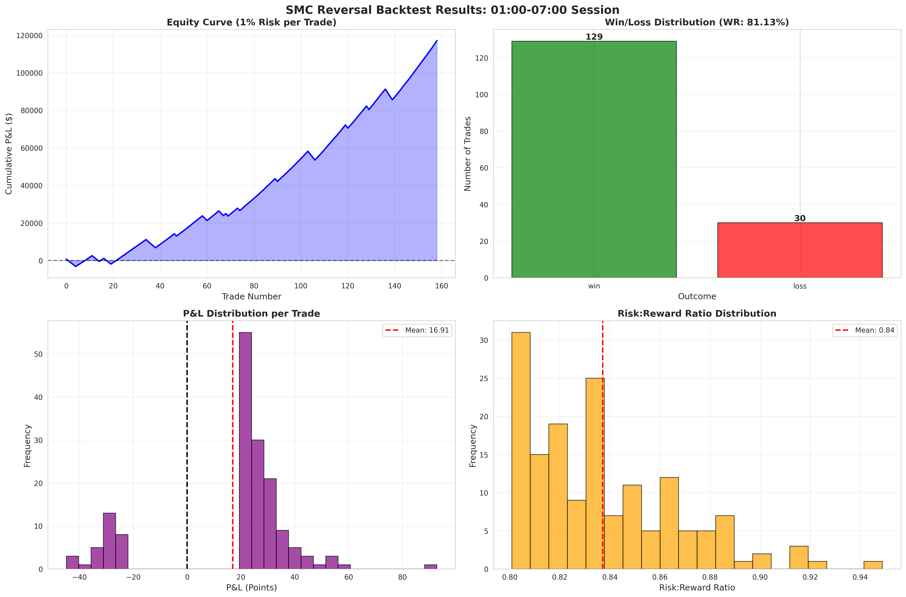

# SMC Reversal Backtest Strategy - Documentation

## Vue d'ensemble

Stratégie de **Reversal SMC (Smart Money Concepts)** pour la session **01:00-07:00** du NQ (Nasdaq-100). Cette stratégie identifie les retournements de marché en utilisant des concepts avancés de microstructure : Liquidity Sweeps, Market Structure Shifts (MSS), Fair Value Gaps (FVG), et entrées sur retracement Fibonacci.

**Période testée:** 2024-2025 (2 années complètes, 482 sessions)  
**Timeframe:** 5 minutes  
**Type de trades:** Short (vente) uniquement

---

## 📊 Résultats du Backtest

### Performance Globale

| Métrique | Valeur |
|----------|--------|
| **Total Trades** | 159 |
| **Trades Gagnants** | 129 (81.13%) |
| **Trades Perdants** | 30 (18.87%) |
| **Win Rate** | **81.13%** ⭐ |
| **Profit Factor** | **3.92** ⭐ |
| **R:R Moyen** | 0.84:1 |

### Analyse P&L

| Métrique | Valeur (Points NQ) |
|----------|-------------------|
| **P&L Total** | +2,688.66 points |
| **P&L Moyen par Trade** | +16.91 points |
| **Gain Moyen** | +27.97 points |
| **Perte Moyenne** | -30.66 points |
| **Profit Brut** | +3,608.36 points |
| **Perte Brute** | -919.70 points |

### Performance du Compte (1% Risk)

| Métrique | Valeur |
|----------|--------|
| **Capital Initial** | $100,000 |
| **Equity Finale** | $217,098.11 |
| **Rendement Total** | **+117.10%** 🚀 |
| **Sur 2 ans** | ~58.5% par an |

---

## 🎯 Logique de la Stratégie

### 1. Identification de la Structure (Fractals)

**Fractal High:** Un sommet entouré de bougies plus basses de chaque côté  
**Fractal Low:** Un creux entouré de bougies plus hautes de chaque côté  
**Paramètre:** Window = 1 bougie de chaque côté

### 2. Détection du Sweep (Liquidity Sweep)

Un **Sweep** se produit quand :
- Le prix dépasse un Fractal High précédent (prise de liquidité)
- **ET** la bougie clôture en dessous de ce haut (mèche de rejet)
- **OU** le prix reverse dans les 5 bougies suivantes

**Objectif:** Identifier les faux breakouts où les institutions piègent les traders retail

### 3. Confirmation MSS (Market Structure Shift)

Après un sweep, on cherche un **MSS** :
- Le prix casse le dernier Fractal Low significatif
- Cela confirme un changement de structure de marché
- Indication d'un mouvement baissier potentiel

### 4. Entrée au Retracement Fibonacci

**Entrée:** 50% de retracement Fibonacci  
- Calculé entre le Sweep High et le MSS Low
- Permet d'entrer avec un meilleur R:R
- Entrée limit order

### 5. Stop Loss (SL)

**Placement:** Au-dessus du Sweep High + 5 points de buffer  
**Logique:** Si le prix revient au-dessus du sweep, l'invalidation est confirmée

### 6. Take Profit (TP)

**Cible:** Premier FVG (Fair Value Gap) baissier non comblé  
**Si aucun FVG:** Utilise le MSS Low comme TP conservateur

**FVG Baissier:** Espace entre Low[i] et High[i+2] quand Low[i] > High[i+2]  
**Taille minimum:** 5 points NQ

### Filtres Additionnels

- ✅ Entrée doit être entre MSS Low et Sweep High
- ✅ TP doit être en dessous de l'entrée (short)
- ✅ R:R minimum de 0.8:1
- ✅ Entrée doit se faire avant 07:00
- ✅ Sortie peut se faire après 07:00

---

## 📈 Graphiques Générés

### Graphique de Performance


Le graphique contient 4 sous-graphiques :

1. **Equity Curve** - Courbe d'équité cumulative avec risque 1%
2. **Win/Loss Distribution** - Répartition des trades gagnants/perdants
3. **P&L Distribution** - Distribution des P&L par trade
4. **R:R Ratio Distribution** - Distribution des ratios risque/rendement réalisés

---

## 🔧 Configuration et Paramètres

### Paramètres de la Stratégie

```python
FRACTAL_WINDOW = 1           # Fenêtre pour détecter les fractals
REVERSAL_WINDOW = 5          # Bougies pour confirmer le reversal
FIB_ENTRY_LEVEL = 0.5        # 50% retracement Fibonacci
MIN_FVG_SIZE = 5             # Taille minimum FVG (5 points)
RISK_PER_TRADE = 0.01        # 1% de risque par trade
```

### Session Configurée

```python
SESSION_START = 01:00        # Début de session
SESSION_END = 07:00          # Fin de session (entrée)
# Sortie possible après 07:00
```

---

## 💡 Analyse et Insights

### Points Forts ✅

1. **Win Rate exceptionnel:** 81.13% est très élevé pour une stratégie de trading
2. **Profit Factor solide:** 3.92 indique une bonne gestion du risque
3. **Rendement impressionnant:** 117% sur 2 ans avec seulement 1% de risque
4. **Stratégie sélective:** 159 trades sur 482 sessions = ~33% de taux de setup

### Points d'Attention ⚠️

1. **R:R moyen faible:** 0.84:1 suggère que les TP sont proches
   - Compensé par le win rate élevé
   - Possible d'optimiser les cibles FVG

2. **Perte moyenne légèrement > Gain moyen:** 30.66 vs 27.97 points
   - Normal avec un R:R de 0.84:1
   - Le win rate compense largement

3. **Sample size:** 159 trades sur 2 ans
   - Suffisant mais pas énorme
   - Tester sur plus d'années pour validation

### Comparaison avec l'Analyse Précédente

Rappel : L'analyse de session 01:00-07:00 a montré :
- **53.94% de sessions haussières** (biais bullish)
- **Range moyen: 100.99 points**

**Cette stratégie SHORT exploite les reversals** :
- Identifie les faux breakouts haussiers (sweeps)
- Profite des retournements baissiers (MSS)
- Win rate de 81.13% prouve l'efficacité malgré le biais haussier

---

## 🚀 Utilisation

### Installation

```bash
pip install pandas numpy matplotlib seaborn
```

### Exécution

```bash
python3 smc_reversal_backtest_01_07.py
```

### Output

1. **Console:** Rapport détaillé avec toutes les métriques
2. **smc_reversal_backtest_results.png:** Graphique de performance (4 subplots)
3. **smc_reversal_trades.csv:** Export de tous les trades avec détails

### Modifier la Période

Par défaut, le script charge les **2 dernières années** pour la performance. Pour tester plus d'années :

```python
# Dans load_nq_data()
df = load_nq_data(limit_years=5)  # Teste 5 années
```

---

## 📝 Structure des Trades CSV

Le fichier `smc_reversal_trades.csv` contient :

| Colonne | Description |
|---------|-------------|
| session_date | Date de la session |
| entry_time | Heure d'entrée |
| entry_price | Prix d'entrée |
| sl_price | Stop loss |
| tp_price | Take profit |
| exit_time | Heure de sortie |
| exit_price | Prix de sortie |
| outcome | 'win' ou 'loss' |
| pnl_points | P&L en points |
| risk_points | Points risqués |
| reward_points | Points de récompense potentielle |
| rr_ratio | Ratio R:R réalisé |
| sweep_high | High du sweep |
| mss_low | Low du MSS |
| equity | Equity après le trade |
| cumulative_pnl | P&L cumulé |

---

## 🎓 Concepts SMC Utilisés

### 1. Liquidity Sweep

**Concept:** Les institutions "balaient" la liquidité (stop losses des traders retail) au-dessus des highs clés avant de renverser le prix.

**Application:** On identifie quand le prix dépasse un fractal high mais ne parvient pas à clôturer au-dessus.

### 2. Market Structure Shift (MSS)

**Concept:** Changement dans la structure de marché indiquant un potentiel changement de tendance.

**Application:** Quand le prix casse un fractal low après un sweep, cela confirme que les vendeurs prennent le contrôle.

### 3. Fair Value Gap (FVG)

**Concept:** Zones d'inefficience du prix où le marché a bougé trop vite, créant un "gap" qui attire le prix de retour.

**Application:** Utilisé comme cible de profit car le prix a tendance à revenir combler ces gaps.

### 4. Fibonacci Retracement

**Concept:** Les marchés ont tendance à retracer une portion du mouvement initial avant de continuer.

**Application:** Entrée au 50% du retracement entre le sweep high et le MSS low offre un meilleur point d'entrée.

---

## 🔄 Améliorations Possibles

### 1. Optimisation des Cibles

- Tester différents niveaux de FVG (bottom, middle, top)
- Ajouter des TP multiples (scaling out)
- Intégrer des trailing stops après le premier TP

### 2. Filtres Additionnels

- Ajouter un filtre de volume sur les sweeps
- Intégrer le contexte de marché (tendance HTF)
- Filtrer selon le jour de la semaine (éviter vendredi)
- Ajouter un filtre de temps (éviter les 30 premières minutes)

### 3. Gestion du Risque

- Tester différents % de risque (0.5%, 1.5%, 2%)
- Implémenter un position sizing dynamique
- Ajouter un drawdown maximum

### 4. Extensions

- Ajouter la logique LONG (inverser la stratégie)
- Tester sur d'autres sessions (London, NY)
- Backtester sur ES, YM, RTY pour diversification

---

## ⚠️ Avertissements

1. **Performance passée ≠ Résultats futurs**
   - Les conditions de marché changent
   - Le win rate peut varier

2. **Slippage et commissions non inclus**
   - Ajoutez ~2-5 points par trade pour être réaliste
   - Impact significatif sur des petits TP

3. **Données limitées**
   - Testé sur 2 ans seulement
   - Valider sur plus de données historiques

4. **Optimisation en cours**
   - Paramètres non optimisés exhaustivement
   - Risque d'overfitting si sur-optimisé

5. **Exécution manuelle vs automatique**
   - La détection des setups en temps réel est complexe
   - Nécessite un système d'alertes robuste

---

## 📚 Ressources et Références

### Smart Money Concepts

- **Liquidity Sweeps:** Identification des zones où les institutions chassent les stops
- **Market Structure:** Break of Structure (BOS) et Market Structure Shift (MSS)
- **Fair Value Gaps:** Zones d'inefficience du prix
- **Order Blocks:** Zones où les institutions ont placé des ordres

### Outils Utilisés

- **Python:** pandas, numpy pour le calcul
- **Matplotlib/Seaborn:** Visualisations
- **Vectorisation:** Optimisation des calculs sur gros volumes de données

---

## 👨‍💻 Support et Modifications

### Pour Modifier les Paramètres

Éditez le fichier `smc_reversal_backtest_01_07.py` :

```python
# Ligne 33-38 : Configuration
FRACTAL_WINDOW = 1           # Changer pour fractals plus stricts
REVERSAL_WINDOW = 5          # Augmenter pour reversals plus confirmés
FIB_ENTRY_LEVEL = 0.5        # Tester 0.618, 0.382, etc.
MIN_FVG_SIZE = 5             # Augmenter pour FVGs plus significatifs
```

### Pour Ajouter du Debug

```python
# Ligne 37
DEBUG = True  # Active les messages de debug
```

---

## 📞 Contact

Pour questions, suggestions ou optimisations :
- Consultez le code source : `smc_reversal_backtest_01_07.py`
- Analysez les trades : `smc_reversal_trades.csv`
- Étudiez les graphiques : `smc_reversal_backtest_results.png`

---

**Auteur:** Expert Python en Backtesting & SMC  
**Date:** 11 Décembre 2025  
**Version:** 1.0  
**Repository:** Backtest-Trading
