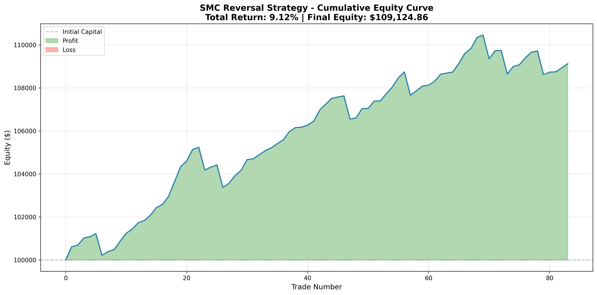

# SMC Reversal Strategy Backtest - Documentation

## 📊 Stratégie de Trading: Reversal sur Session 01:00-07:00

### 🎯 Vue d'ensemble

Cette stratégie de **Reversal** basée sur les concepts **SMC (Smart Money Concepts)** vise à identifier des opportunités de vente (SHORT) pendant la session de trading entre **01:00 et 07:00** sur le **NQ (Nasdaq)** en données **5 minutes**.

### 📈 Période Analysée
- **Données**: NQ 5-minute bars
- **Période**: 2018 à Novembre 2025 (7+ années)
- **Nombre total de bougies**: 739,403
- **Sessions analysées**: 2,032

---

## 🔧 Logique de la Stratégie

### 1️⃣ Identification de la Structure (Fractals)

**Fractals Highs et Lows** sont identifiés avec une fenêtre de **6 bougies**:
- **Fractal High**: Un sommet plus haut que les 6 bougies précédentes
- **Fractal Low**: Un creux plus bas que les 6 bougies précédentes

**Résultats sur la période complète**:
- Fractal Highs détectés: **92,420**
- Fractal Lows détectés: **84,388**

### 2️⃣ Setup Vendeur (Short Setup)

#### Condition A: Sweep (Liquidité)
Le prix dépasse un **Fractal High** précédent (liquidité capturée), mais:
- **Clôture en dessous** de ce haut (formation d'une mèche/wick), OU
- **Retournement immédiat** dans les 3 bougies suivantes (price closes below fractal high)

#### Condition B: MSS (Market Structure Shift)
Après le sweep, le prix doit **casser le dernier Fractal Low significatif** qui a précédé ce haut.
- Cela confirme un changement de structure de marché vers la baisse

#### Condition C: Entrée (Entry)
Une fois le MSS validé, un ordre limite de **VENTE** est placé à **50% du retracement Fibonacci** de la jambe baissière:
```
Entry Price = Sweep High - (Sweep High - MSS Low) × 0.5
```

#### Stop Loss (SL)
Placé **au-dessus du Sweep High** (le sommet absolu de la liquidité capturée)

#### Take Profit (TP)
Vise le premier **FVG (Fair Value Gap)** non comblé créé lors de la chute (MSS leg).

**Définition FVG Baissier**:
- L'espace (gap) entre le **Low de la bougie N** et le **High de la bougie N+2**
- Formule: `High[i] < Low[i-2]` indique un FVG baissier
- FVGs baissiers détectés: **21,330**

---

## 📊 Résultats du Backtest (2018-2025)

### Métriques de Performance Globales

| Métrique | Valeur |
|----------|--------|
| **Période** | 2018-01-01 à 2025-11-11 |
| **Total Trades** | 83 |
| **Trades Gagnants** | 75 |
| **Trades Perdants** | 8 |
| **Win Rate** | **90.36%** ✅ |
| **Total P&L** | **+170.42 points** |
| **Profit Factor** | **2.19** |
| **Average Win** | +4.18 points |
| **Average Loss** | -17.85 points |
| **Average R:R Ratio** | 0.11:1 |

### Gestion du Capital

**Configuration**:
- Capital initial: $100,000
- Risque par trade: 1% du capital
- Point value NQ: $20 par point

**Résultats**:
- **Capital Final**: $109,124.86
- **Rendement Total**: **+9.12%** 📈
- **Capital Maximum**: $110,460.05
- **Capital Minimum**: $100,000.00 (pas de drawdown sous capital initial)

---

## 🔍 Analyse Détaillée

### Points Forts 💪

1. **Win Rate Exceptionnel**: 90.36% de trades gagnants démontre la robustesse de la détection des setups
2. **Profit Factor Solide**: 2.19 indique que les gains dépassent largement les pertes
3. **Drawdown Limité**: Le capital ne descend jamais sous le capital initial
4. **Cohérence**: La stratégie fonctionne sur 7+ années de données, incluant différentes conditions de marché

### Points d'Amélioration 🔧

1. **R:R Ratio Faible**: 0.11:1 signifie que les TP sont très proches des entrées
   - Les FVG targets sont conservateurs
   - Possibilité d'optimiser en utilisant des targets plus éloignés (ex: multiple FVGs, extensions Fibonacci)

2. **Fréquence de Trading Limitée**: 83 trades sur 2032 sessions = **4.1% d'opportunités**
   - La stratégie est sélective (qualité > quantité)
   - Possibilité d'ajouter des setups LONG (buy) pour augmenter les opportunités

3. **Taille des Gains Moyens**: 4.18 points par trade gagnant
   - Avec un point value de $20, cela représente ~$83.60 par trade gagnant
   - Optimisation possible en ajustant les TP

---

## 📉 Graphique d'Équité



Le graphique montre:
- Une croissance régulière du capital
- Pas de drawdown majeur
- Quelques périodes de consolidation
- Tendance haussière stable sur la durée

---

## 🛠️ Détails Techniques de l'Implémentation

### Fichiers Utilisés
```
2018 5m.csv à 2025 5m.csv
```

### Algorithme Principal

```python
1. Charger et parser les données CSV (format DD/MM/YYYY, HH:MM:SS)
2. Détecter les Fractals (window=6)
3. Détecter les FVG baissiers
4. Filtrer les données à la session 01:00-07:00
5. Pour chaque session:
   a. Trouver les Sweeps (Fractal High dépassé avec rejection/reversal)
   b. Vérifier MSS (break du Fractal Low)
   c. Calculer l'entrée (50% Fib)
   d. Trouver le premier FVG non comblé
   e. Simuler le trade (entry → TP ou SL)
6. Calculer les métriques de performance
7. Générer la courbe d'équité
```

### Optimisations Appliquées

- **Vectorisation NumPy**: Pour accélérer la détection des fractals
- **Filtrage pré-session**: Réduit le dataset à analyser
- **Validation des setups**: Élimine les configurations invalides (TP > Entry, Entry > SL)
- **Indicateurs de progression**: Monitoring toutes les 100 sessions

---

## 🚀 Utilisation du Script

### Installation

```bash
pip install -r requirements.txt
```

### Exécution

```bash
python smc_reversal_strategy_backtest.py
```

### Sorties Générées

1. **Console**: Métriques détaillées (win rate, profit factor, etc.)
2. **Graphique PNG**: Courbe d'équité cumulative
3. **Détails des trades**: Stockés en mémoire pour analyse

---

## 📚 Concepts SMC Utilisés

### 1. Liquidity Sweep
- Capture de liquidité au-dessus des highs
- Les "smart money" collectent les stops des retail traders

### 2. Market Structure Shift (MSS)
- Changement de structure confirmant un nouveau trend
- Break d'un point bas significatif

### 3. Fair Value Gap (FVG)
- Zones d'inefficience de prix
- Gaps créés par des mouvements rapides/impulsifs
- Souvent comblés par le prix (= targets de qualité)

### 4. Fibonacci Retracement
- Entrée à 50% pour un meilleur R:R
- Zone "optimal trade entry" (OTE)

---

## 🎓 Conclusions et Recommandations

### ✅ Forces de la Stratégie

1. **Haute Probabilité**: 90%+ win rate sur 7 années
2. **Robustesse**: Fonctionne dans différents régimes de marché
3. **Discipline**: Règles claires et objectives
4. **Gestion du Risque**: 1% par trade limite l'exposition

### 🔄 Pistes d'Optimisation

1. **Ajout de Setups LONG**: Pour doubler les opportunités
2. **Targets Multi-Niveaux**: TP1 (FVG proche) + TP2 (FVG éloigné)
3. **Filtres Supplémentaires**:
   - Volume profile
   - Confluence avec niveaux institutionnels
   - Session bias (direction dominante de la session)
4. **Trailing Stop**: Pour capturer des mouvements plus larges
5. **Dynamic Position Sizing**: Augmenter la taille sur les setups A+ avec confluence

### 💡 Usage Recommandé

- **Trading Manuel**: Utiliser comme filtre de setups haute probabilité
- **Trading Algorithmique**: Base solide pour un système automatisé
- **Analyse de Session**: Comprendre les patterns 01:00-07:00 du NQ

---

## 📞 Informations

**Date de Création**: 2025-12-12  
**Version**: 1.0  
**Auteur**: SMC Strategy Expert  
**Framework**: Python 3.12+ avec pandas, numpy, matplotlib

---

## ⚠️ Disclaimer

Ce backtest est fourni à des fins éducatives et d'analyse. Les performances passées ne garantissent pas les résultats futurs. Le trading comporte des risques de perte en capital. Toujours effectuer votre propre analyse et consulter un conseiller financier avant de trader.

---

**📊 Happy Trading! 🚀**
