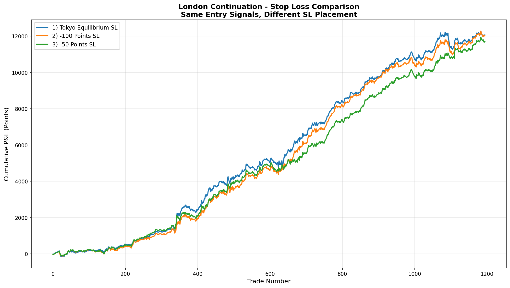

# London Continuation - Analyse Comparative des Stop Loss

## 📋 Vue d'ensemble

Cette analyse compare **3 placements différents de Stop Loss** pour la stratégie London Continuation, tout en gardant **le même point de sortie à 07:00 CST**. L'objectif est de déterminer quel SL offre le meilleur compromis entre protection du capital et maximisation des profits.

## 🎯 Les 3 Variantes Testées

### 1) Tokyo Equilibrium SL (SL à l'équilibre de la session)
- **Placement** : Asian Mid = (Asian_High + Asian_Low) / 2
- **Logique** : Utilise le point d'équilibre de la range Tokyo/Asian comme niveau de SL
- **Distance moyenne** : ~50.91 points

### 2) SL à -100 Points (Catastrophe SL)
- **Placement** : Entry Price ± 100 points
- **Logique** : Protection large contre les mouvements extrêmes
- **Distance fixe** : 100.00 points

### 3) SL à -50 Points (SL Intermédiaire)
- **Placement** : Entry Price ± 50 points
- **Logique** : Compromis entre protection et espace de respiration
- **Distance fixe** : 50.00 points

## 📊 Résultats Comparatifs (1,195 Trades | 2018-2025)

### Performance Globale

| Variante | Total P&L | Win Rate | Profit Factor | Expectancy | Sharpe Ratio |
|----------|-----------|----------|---------------|------------|--------------|
| **1) Tokyo Equilibrium** | **+12,072.66 pts** ✅ | 56.32% | 1.63 | **+10.10** ✅ | 2.66 |
| **2) -100 Points** | +12,047.01 pts | **58.08%** ✅ | 1.63 | +10.08 | **2.70** ✅ |
| **3) -50 Points** | +11,705.91 pts | 55.23% | **1.65** ✅ | +9.80 | **2.84** ✅ |

### Drawdown Analysis

| Variante | Max DD (pts) | Max DD (%) | Meilleur DD |
|----------|--------------|------------|-------------|
| 1) Tokyo Equilibrium | -942.56 | -7.68% | ❌ |
| 2) -100 Points | -837.07 | -6.82% | ❌ |
| 3) -50 Points | **-508.09** ✅ | **-4.26%** ✅ | ✅ **MEILLEUR** |

### Stop Loss Hit Statistics

| Variante | SL Touchés | Time Exits | SL Hit Rate | Impact |
|----------|------------|------------|-------------|--------|
| 1) Tokyo Equilibrium | 290 (24.27%) | 905 (75.73%) | Élevé | Protection modérée |
| 2) -100 Points | **81 (6.78%)** ✅ | **1,114 (93.22%)** ✅ | **Minimal** ✅ | Protection large |
| 3) -50 Points | 288 (24.10%) | 907 (75.90%) | Élevé | Protection serrée |

### Wins vs Losses Analysis

| Variante | Wins | Losses | Avg Win | Avg Loss | Ratio W/L |
|----------|------|--------|---------|----------|-----------|
| 1) Tokyo Equilibrium | 673 (56.32%) | 522 (43.68%) | +46.40 | -36.69 | 1.26:1 |
| 2) -100 Points | **694 (58.08%)** ✅ | 501 (41.92%) | +45.06 | -38.37 | 1.17:1 |
| 3) -50 Points | 660 (55.23%) | 535 (44.77%) | +45.16 | **-33.83** ✅ | 1.33:1 |

## 📈 Equity Curves Comparison



**Observation** : Les 3 courbes suivent des trajectoires très similaires, avec des différences mineures dues aux SL touchés.

## 💡 Insights Clés

### 🥇 Meilleur Profit Net : Tokyo Equilibrium (+12,072.66 pts)
- **Avantage** : Capture +25.65 pts de plus que -100pts et +366.75 pts de plus que -50pts
- **Distance dynamique** : S'adapte à la volatilité de chaque session (~50.91 pts en moyenne)
- **SL Hit Rate** : 24.27% (290 trades stoppés)
- **Conclusion** : Meilleur compromis profit/risque avec adaptation à la structure du marché

### 🥈 Meilleur Win Rate : -100 Points (58.08%)
- **Avantage** : Seulement 6.78% de SL touchés (81/1,195)
- **Protection large** : Laisse respirer le trade durant la volatilité de Londres
- **Drawdown** : -837.07 pts (2e meilleur)
- **Sharpe** : 2.70 (excellent)
- **Conclusion** : Idéal pour traders averses au risque cherchant stabilité psychologique

### 🥉 Meilleur Drawdown : -50 Points (-4.26%)
- **Avantage** : Drawdown **46% inférieur** à Tokyo EQ et **39% inférieur** à -100pts
- **Stabilité** : Courbe d'équité la plus lisse (Sharpe 2.84 ✅)
- **Coût** : -366.75 pts de profit net vs Tokyo EQ (-3.0%)
- **SL Hit Rate** : 24.10% (288 trades stoppés)
- **Conclusion** : Protection stricte qui limite les gains mais maximise la consistance

## 🔍 Analyse Détaillée

### Pourquoi Tokyo Equilibrium Gagne ?

1. **Adaptation à la volatilité** : Distance de SL varie selon la Asian Range (25-80 pts typiquement)
2. **Placement logique** : Asian Mid = zone neutre institutionnelle, respectée par le marché
3. **Meilleur ratio Risk/Reward** : Avg Win (46.40) / Avg Loss (-36.69) = 1.26:1
4. **Profit Factor stable** : 1.63 sur 7 ans montre robustesse

### Pourquoi -100 Points est aussi Performant ?

1. **Protection catastrophe efficace** : Seulement 81 SL touchés en 7 ans (1.1% par an)
2. **Capture des Trend Days** : 93.22% des trades vont jusqu'à 07:00
3. **Win Rate supérieur** : 58.08% vs 56.32% pour Tokyo EQ
4. **Psychologie** : Moins de stress, meilleure confiance dans le système

### Pourquoi -50 Points Sous-Performe ?

1. **SL trop serré** : Touché 288 fois (24.10%) durant volatilité normale de Londres
2. **Sorties prématurées** : Coupe des trades qui auraient gagné à 07:00
3. **Opportunité perdue** : -366.75 pts vs Tokyo EQ sur 7 ans (~52 pts/an)
4. **Avantage** : Drawdown minimal pour compte de petite taille

## 🎯 Recommandations par Profil de Trader

### Pour Maximiser les Profits
**→ Tokyo Equilibrium SL** (+12,072.66 pts)
- Meilleur P&L absolu
- Adaptation automatique à la volatilité
- Placement basé sur structure institutionnelle
- Acceptable : 24.27% SL hit rate, -7.68% DD

**Configuration** :
```python
SL = (Asian_High + Asian_Low) / 2
Exit = 07:00 CST (ou SL si touché avant)
```

### Pour Maximiser la Stabilité
**→ -100 Points SL** (+12,047.01 pts)
- Win Rate le plus élevé (58.08%)
- SL rarement touché (6.78%)
- Sharpe Ratio excellent (2.70)
- DD acceptable (-6.82%)

**Configuration** :
```python
SL_LONG = Entry_Price - 100 points
SL_SHORT = Entry_Price + 100 points
Exit = 07:00 CST (ou SL si touché avant)
```

### Pour Minimiser le Drawdown
**→ -50 Points SL** (+11,705.91 pts)
- Drawdown minimal (-4.26% ✅)
- Sharpe Ratio le meilleur (2.84)
- Équité curve la plus lisse
- Coût : -3% de profit vs Tokyo EQ

**Configuration** :
```python
SL_LONG = Entry_Price - 50 points
SL_SHORT = Entry_Price + 50 points
Exit = 07:00 CST (ou SL si touché avant)
```

## 📊 Comparaison avec Version Pure Time Exit

| Version | Total P&L | Win Rate | SL Hit Rate | Max DD | Sharpe |
|---------|-----------|----------|-------------|--------|--------|
| **Pure Time (Baseline)** | +12,739 pts | 58.66% | 0% (aucun SL) | -917 pts | 2.73 |
| **Tokyo EQ SL** | +12,073 pts | 56.32% | 24.27% | -943 pts | 2.66 |
| **-100pts SL** | +12,047 pts | 58.08% | 6.78% | -837 pts | 2.70 |
| **-50pts SL** | +11,706 pts | 55.23% | 24.10% | -508 pts | 2.84 |

**Coût du SL** :
- Tokyo EQ : -666 pts (-5.2% vs Pure Time)
- -100pts : -692 pts (-5.4% vs Pure Time) ← **Meilleur compromis**
- -50pts : -1,033 pts (-8.1% vs Pure Time)

## 🚀 Conclusion & Trading Recommendations

### 🏆 Classement Final

1. **🥇 Tokyo Equilibrium SL** - **RECOMMANDÉ pour Production**
   - Meilleur profit net (+12,072.66 pts)
   - Placement intelligent basé sur structure
   - Adaptation automatique à la volatilité
   - Drawdown acceptable pour les gains générés

2. **🥈 -100 Points SL** - **RECOMMANDÉ pour Risk-Averse Traders**
   - Protection catastrophe efficace (6.78% hit rate)
   - Win Rate supérieur (58.08%)
   - Excellente stabilité psychologique
   - Coût modéré (-5.4% vs Pure Time)

3. **🥉 -50 Points SL** - **RECOMMANDÉ pour Small Accounts**
   - Drawdown minimal (-4.26%)
   - Sharpe Ratio optimal (2.84)
   - Protection stricte du capital
   - Sacrifice de ~3% de profit acceptable

### ✅ Configuration de Production Recommandée

**Approche Hybride** :
```python
# Calculer SL Tokyo Equilibrium
asian_mid = (asian_high + asian_low) / 2

# Si distance > 100 pts, cap à 100 pts (protection catastrophe)
if direction == 'LONG':
    sl_tokyo = asian_mid
    sl_distance = entry_price - sl_tokyo
    if sl_distance > 100:
        sl = entry_price - 100  # Cap à -100pts
    else:
        sl = sl_tokyo
else:  # SHORT
    sl_tokyo = asian_mid
    sl_distance = sl_tokyo - entry_price
    if sl_distance > 100:
        sl = entry_price + 100  # Cap à +100pts
    else:
        sl = sl_tokyo

# Exit toujours à 07:00 CST si SL non touché
exit_time = 07:00 CST
```

### ❌ À Éviter

- **Ne pas utiliser** de SL plus serré que 50 points (coût trop élevé)
- **Ne pas dépasser** 100 points de distance SL (inefficace)
- **Ne jamais** trader sans SL en réel (risque de catastrophe)

### 📈 Backtests Additionnels Suggérés

1. **Trailing Stop** : Déplacer SL au breakeven après +50pts de profit
2. **ATR-Based SL** : SL = Entry ± 2*ATR(14) pour adaptation dynamique
3. **Time-Based Trailing** : Resserrer SL après 05:00 CST (pré-NY open)
4. **Volume Profile SL** : Placer SL sous/sur POC de la session précédente

## 📁 Fichiers Générés

- `london_sl_comparison_table.csv` - Tableau comparatif des 3 variantes
- `london_sl_1_Tokyo_EQ_results.csv` - Détails 1,195 trades Tokyo Equilibrium
- `london_sl_2_100pts_results.csv` - Détails 1,195 trades -100 points
- `london_sl_3_50pts_results.csv` - Détails 1,195 trades -50 points
- `london_sl_comparison_equity.png` - Equity curves comparées

## 🔧 Utilisation

```bash
# Lancer l'analyse
python3 london_sl_comparison.py

# Consulter les résultats
cat london_sl_comparison_table.csv
```

---

**Dernière Mise à Jour** : 07 Décembre 2025  
**Période Analysée** : 2018-2025 (7 ans)  
**Trades Analysés** : 1,195 setups identiques  
**Résultat** : Tokyo Equilibrium SL offre le meilleur compromis profit/risque
