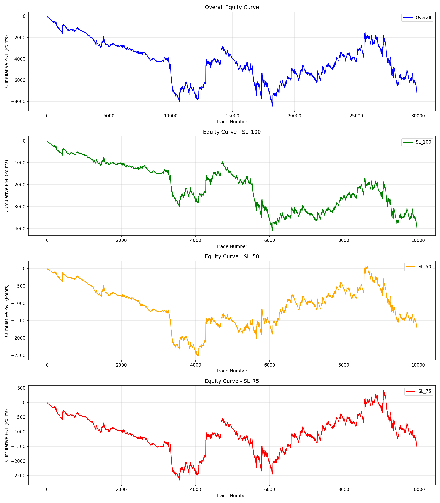

# NQ Futures Breakout Backtest Report

**Generated:** 2025-11-28 17:49:01

**Data Period:** 2018 - 2025

**Total Data Points:** 2,771,419


## Strategy Overview

This backtest evaluates a breakout trading strategy based on:
- Oblique trendline breakouts (resistance for LONG, support for SHORT)
- Momentum confirmation (candle body > average)
- Multiple stop-loss scenarios (50%, 75%, 100% retracement)
- Trading sessions: 02:00-05:00 and 08:30-11:00


## Overall Performance

| Metric | Value |
|--------|-------|
| Total Trades | 29898 |
| Wins | 6244 |
| Losses | 23654 |
| Win Rate | 20.88% |
| Average Win | 20.98 pts |
| Average Loss | 5.84 pts |
| Risk/Reward Ratio | 3.59 |
| Profit Factor | 0.95 |
| Total P&L | -7194.02 pts |
| Maximum Drawdown | -8459.68 pts |


## Performance by Stop Loss Type

| SL Type | Trades | Win Rate | Avg R:R | Profit Factor | Total P&L | Max DD |
|---------|--------|----------|---------|---------------|-----------|--------|
| SL_100 | 9966 | 25.6% | 2.71 | 0.93 | -3959.59 | -4111.16 |
| SL_50 | 9966 | 15.6% | 5.13 | 0.95 | -1710.29 | -2510.68 |
| SL_75 | 9966 | 21.45% | 3.54 | 0.97 | -1524.13 | -2637.89 |


## Performance by Direction

| Direction | Trades | Wins | Losses | Win Rate | Profit Factor | Total P&L |
|-----------|--------|------|--------|----------|---------------|-----------|
| SHORT | 15693 | 3150 | 12543 | 20.07% | 0.91 | -6039.5 |
| LONG | 14205 | 3094 | 11111 | 21.78% | 0.98 | -1154.52 |


## Performance by Trading Session

| Session | Trades | Win Rate | Profit Factor | Total P&L | Max DD |
|---------|--------|----------|---------------|-----------|--------|
| Session_1 (02:00-05:00) | 17595 | 21.64% | 0.99 | -640.47 | -3255.06 |
| Session_2 (08:30-11:00) | 12303 | 19.81% | 0.93 | -6553.54 | -6552.08 |


## Performance by Year

| Year | Trades | Wins | Losses | Win Rate | Profit Factor | Total P&L |
|------|--------|------|--------|----------|---------------|-----------|
| 2018 | 4683 | 906 | 3777 | 19.35% | 0.78 | -2498.94 |
| 2019 | 4476 | 968 | 3508 | 21.63% | 0.81 | -1762.81 |
| 2020 | 3441 | 752 | 2689 | 21.85% | 0.87 | -2390.88 |
| 2021 | 3759 | 805 | 2954 | 21.42% | 1.1 | 1620.71 |
| 2022 | 3309 | 695 | 2614 | 21.0% | 0.96 | -944.3 |
| 2023 | 3846 | 848 | 2998 | 22.05% | 1.12 | 1990.18 |
| 2024 | 3510 | 715 | 2795 | 20.37% | 1.04 | 669.65 |
| 2025 | 2874 | 555 | 2319 | 19.31% | 0.84 | -3877.63 |


## Configuration Used

```yaml
Swing Detection Lookback: 30 bars
Momentum Average Period: 10 periods
Stop Loss Levels: [0.5, 0.75, 1.0]
Trading Session 1: 02:00-05:00
Trading Session 2: 08:30-11:00
```


## Equity Curve




## Trade Log

See `trades_log.csv` for detailed trade-by-trade breakdown.


---

*Report generated by NQ Futures Breakout Backtester*